# Lightfielder | Install Lightfielder

Installation Checklist:

- Install the Lightfielder files
- Setup the Resolve PathMap settings
- Assign a Lightfielder Toolbar Hotkey Entry
- Install [Python and the Python Modules](Install_Python.md)
- Import the [Lightfielder Deliver Page presets](Deliver_Page_Presets.md)
- Configure the Resolve [Metadata Tag Lightfielder preset](Metadata_Tags.md)

## Installation File Paths

For a single user configuration, the Lightfielder resources are typically installed to:

	$HOME/Lightfielder/

The temporary files are saved to:

	$HOME/Lightfielder/Temp/

The Log files are saved to:

	$HOME/Lightfielder/Logs/

The Resolve Studio based Python scripts are located at:

	$HOME/Lightfielder/Resolve/Script/Utility/

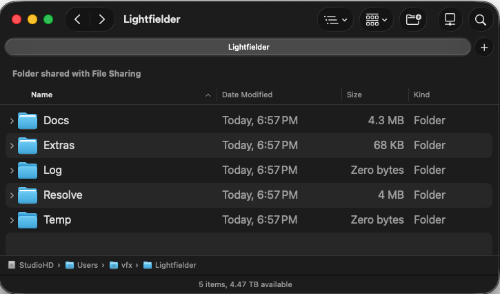

## Resolve PathMaps

Resolve uses the term PathMaps to represent the installation location used for resources like Lua/Python scripts, effects templates, macros, and fuses. The basic process for creating a custom "Lightfielder:" PathMap entry in Resolve's PathMap Preferences involves:

1. Run the premade "`Lightfielder:/Extras/Lightfielder PathMap Setup.lua`" script by copying the text using a text editor, and pasting that text it into the bottom line of the Console window:

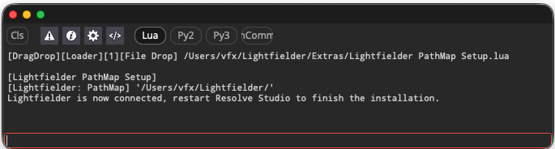

or by:

1. Switch to the Fusion page and then open the "Fusion \> Fusion Settings…" menu.

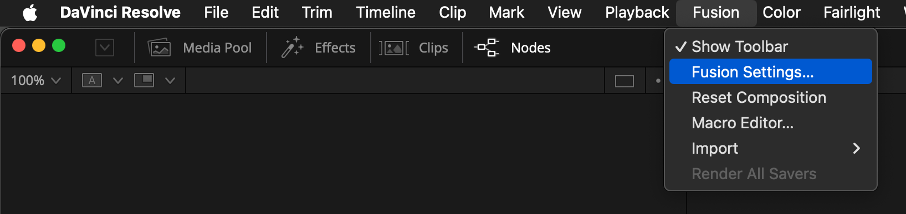

2. Navigate to the "PathMap" section on the left side of the settings dialog:

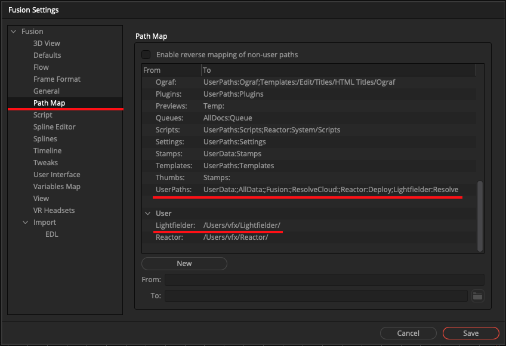

### User:

The User PathMap setting for "Lightfielder" lets Resolve know where the files are installed on your hard disk. This makes Lightfielder portable so it can be installed in a cross-platform compatible way.

(Linux)  
**From:** `Lightfielder:`  
**TO:** `/home/Me/Lightfielder/`  

(macOS)  
**From:** `Lightfielder:`  
**To:** `/Users/Me/Lightfielder/`  

(Windows)  
**From:** `Lightfielder:`  
**To**: `C:\\Users\\Me\\Lightfielder\\`  

### Defaults:

The "UserPath" PathMap setting tells Resolve that the Lightfielder folder has Python scripts that should be loaded into the Resolve "Workspace" menu.

**From:** `UserPaths:`  
**To:** `UserData:;AllData:;Fusion:;ResolveCloud:;Lightfielder:Resolve`  

**Note:** On a Resolve Studio on Linux system there is a chance the "`;ResolveCloud:`" element does not exist in this text field.

If you are entering multiple values on a PathMap "To" line of text, a semicolon symbol is used as the separator character. 

This separator needs to be inserted manually between individual path segments. This works much the same way as a traditional `$PATH` environment variable functions on macOS and Linux systems.

### Resolve UserPaths Folders

This UserPaths based PathMap entry will automatically create a base "`$HOME/Lightfielder/Resolve/`" folder that is used to hold Python scripts, and other resources with the following sub-folders:

* Brushes  
* Config  
* Defaults  
* Filters  
* Fuses  
* Guides  
* Layouts  
* Library  
* LUTs  
* Macros  
* Modules  
* Plugins  
* Scripts  
* Settings  
* Templates

Resolve Python scripts that appear in the "Workspace \> Scripts \>" menu are placed in the folder path location of "`$HOME/Lightfielder/Resolve/Scripts/`". 

### Resolve Scripts Folders

Inside the "Scripts" folder there are Resolve "page" specific folders that allow you to control where a Python or Lua script shows up in the Resolve UI. (The Lightfielder folder exists inside the Utility folder.)

* Color  
* Comp  
* Deliver  
* Edit  
* Tool  
* Utility  
* Views

The expanded UserPath PathMap created folders on disk look like this:

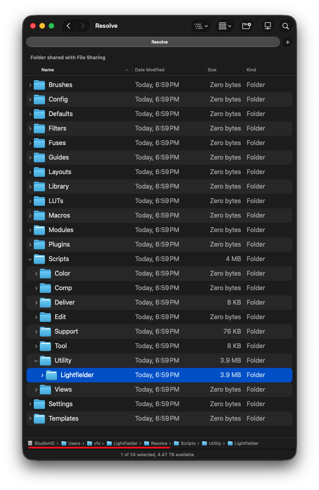

Scripting errors are shown in the Resolve Console window which is accessed using the "Workspace \> Console" menu. In the Resolve Fusion page, the Console can also be shown using the "Shift \+ 0" hotkey.

### PathMap Disaster Recovery

If you have a PathMap issue that causes problems with Resolve, the PathMap settings are stored in a Lua Table structure based file format at the following location:

Relative PathMap:  
	Profiles:/Default/Fusion.prefs

(macOS)  
	$HOME/Library/Application Support/Blackmagic Design/DaVinci Resolve/Fusion/Profiles/Default/Fusion.prefs

(Windows)  
	%appdata%\\Blackmagic Design\\DaVinci Resolve\\Fusion\\Profiles\\Default\\Fusion.prefs

(Linux)  
	$HOME/.local/share/DaVinciResolve/Fusion/Profiles/Default/Fusion.prefs

Rename the file to "`Fusion.prefs.bak`" and that setting file will be skipped. A default "Fusion \> Fusion Settings" menu set of prefs will be generated on the next Resolve launch.

Inside the "`Fusion.prefs`" file the PathMap entries can be found in this section of the Lua Table based text file:  

```
Paths = {  
    Map = {  
        ["Lightfielder:"] = "/Users/Me/Lightfielder/",  
        ["UserPaths:"] = "UserData:;AllData:;Fusion:;Lightfielder:Resolve",
```


To help with troubleshooting, if you want to launch Resolve Studio on Linux from the terminal window you can run:

```bash
cd /opt/resolve/bin/
./resolve
```

## Assign a Toolbar Hotkey Entry

Let's add a custom Lightfielder hotkey entry to the Resolve "Keyboard Customization" window.

Open the "Resolve \> Keyboard Customization..." menu.

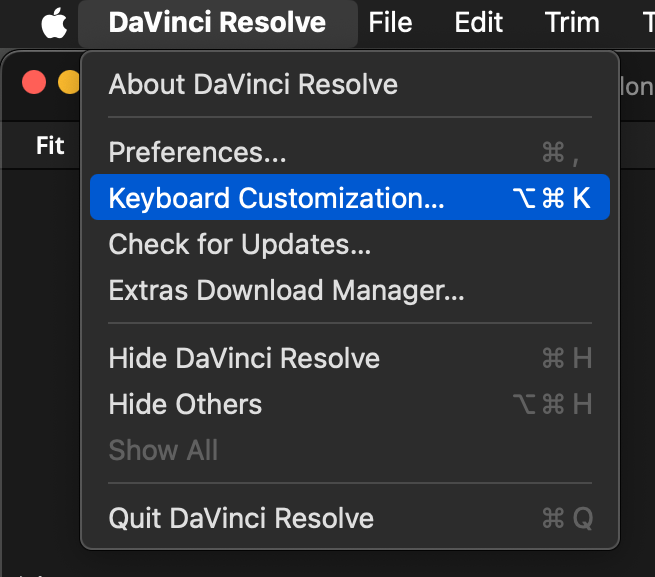

In the "Commands" section of the interface select the "Application \> Workspace \> " entry. 

Scroll down to the "Scripts" section in this list and expand it. Then expand the "Lightfielder" entry. Select the "Lightfielder Toolbar" script in the list.

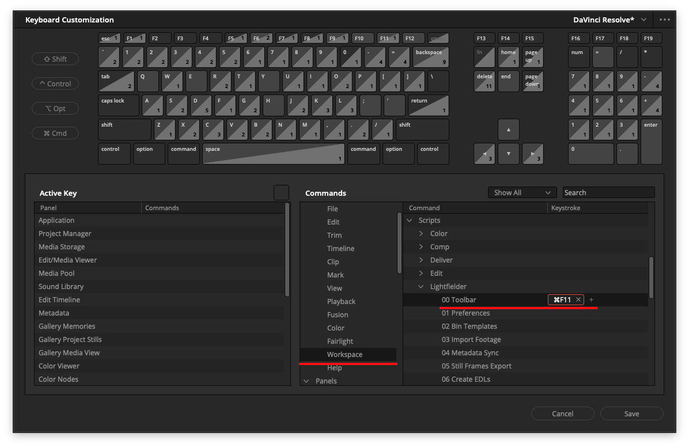

Click in the small rectangular box to the right of the "00 Toolbar" script's name. This region is used to define the hotkey entry we want to store. Press a hotkey combination like "Command \+ F11" and the keys pressed should be visible in the UI.

Open up the "•••" menu at the top-right corner of the Keyboard Customization window.  Then select the "Save as New Preset" menu item.

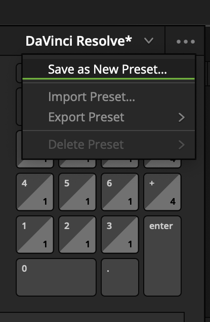

A "Keyboard Mapping Preset" dialog will appear. Enter a preset name in the text field like "Lightfielder". Click the "OK" button to continue.

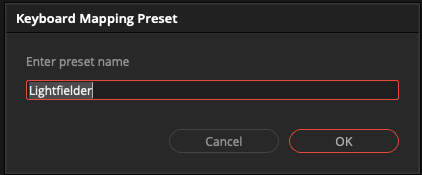

Close the "Keyboard Customization" window. As a note, it is possible to export and import predefined keyboard settings to a file. This makes it easier to configure multiple systems identically.

Now that we have a custom keyboard shortcut for our Lightfielder script we can run it by pressing Command \+ F11 (on macOS) or Control+F11 (on Linux).

The new keyboard shortcut is also visible when you access the "Workspace \> Scripts \> Lightfielder \> 00 Toolbar" menu item. This helps make things discoverable if you forget the mapped hotkey later on. 

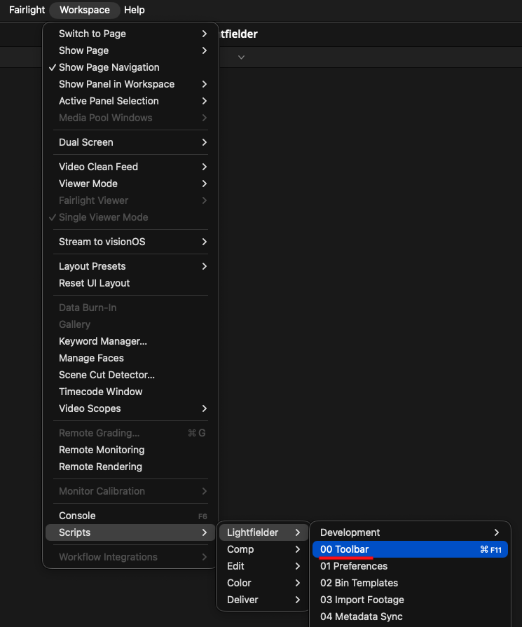

Each time you press the new Lightfielder keyboard shortcut (Command \+ F11) you will see the "Lightfielder Toolbar" window appear.

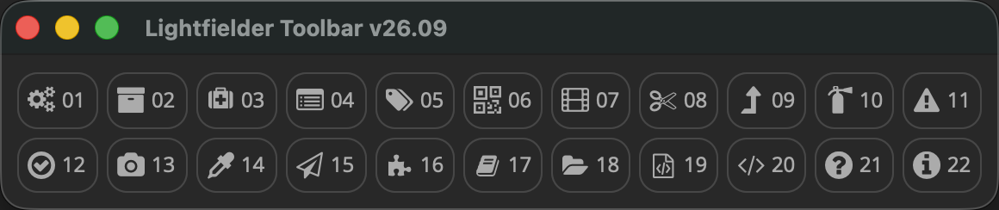
