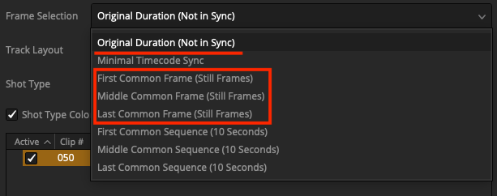

# Lightfielder | Known Issues

## Project Frame Rate

If you are using Lightfielder scripts to build a new timeline, or using a script like EDL Stack Swizzle, you might come across a Console error message like this when you start working with footage from a new shoot that used different settings from the last shoot you did:

`Frame rate mismatch.  Timecode '19:14:36:54' has frames beyond 23`

This error means your Lightfielder preferences for the `Sensor Frame Rate` and `Project Frame Rate` values do not match the R3D footage you are working with. Update the frame rate settings in the [01 Preferences](Scripts_01_Preferences.md) script and then the error should go away.

## Still Frames Export and EDL Creation

It is a good idea to only enable the "Shot Type" checkbox controls for the types that are actually present in your Shotlog.csv file that is listed in the "CSV Source File" text field.

Note: When you browse to select a new Shotlog.csv file, the Shot Type checkboxes should automatically adjust their state based upon the CSV file's description field content.

Note: The "Shot Types" that are enabled but do not have Shotlog.csv entries will see empty timelines generated in the media pool, with zero footage added to those timelines.

## Truncated HTML Tables in Log Reports

- Unexpected error states that occur when running the Lightfielder Python scripts can occasionally cause the HTML table `</tr>` and `</table>` closing elements to be omitted. This is error is visible when several tables are generated at the same time, in tight succession, inside a single log report. This can typically be found in log output when many timelines are generated in a back-to-back fashion by the Lightfielder toolbar scripts.
- Todo: Check for missing HTML closing table entries when Lightfielder log files are written to the Resolve `Console` window and to disk. This will improve the HTML code validation accuracy and the formatting of the table based content.

## Solve the Timeline Based Edit Index Issues

The "Minimal Timecode Sync" option was temporarily hidden in the Lightfielder "Create EDLs" and "Batch Trim" scripts. Hiding this control makes it less likely the option will be accidentally used in the short term. Resolve's native timecode alignment feature can be used.

There was a Resolve scripting API feature regresssion that occurs with DaVinci Resolve v20 and 21 that causes the video to do a "freeze frame" like effect when the "Minimal Timecode Sync" option is used when video editing timelines are created or modified. The Edit page "Edit Index" view shows the root issue at hand where there is a frame hold like identical value applied to the start and end ranges. This issue does not occur when Lightfielder runs in DaVinci Resolve v18.5 - v19.0.3.

The Frame Selection modes highlighted in red are the options that are visible at this time in Lightfielder:

