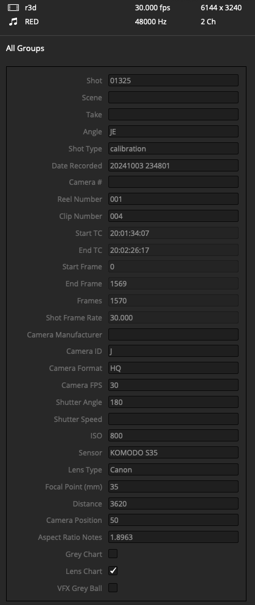
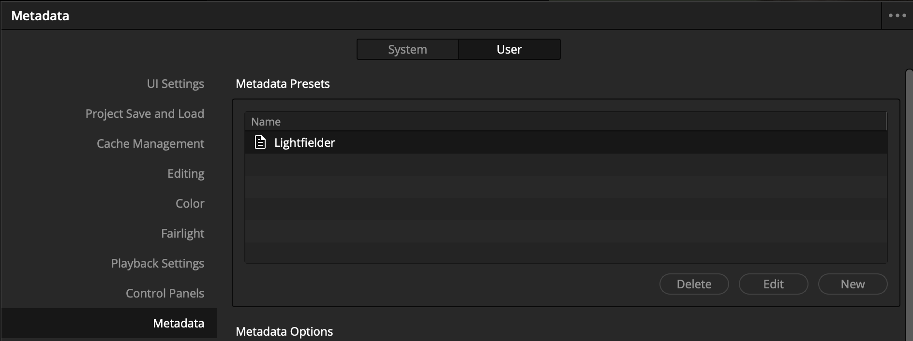
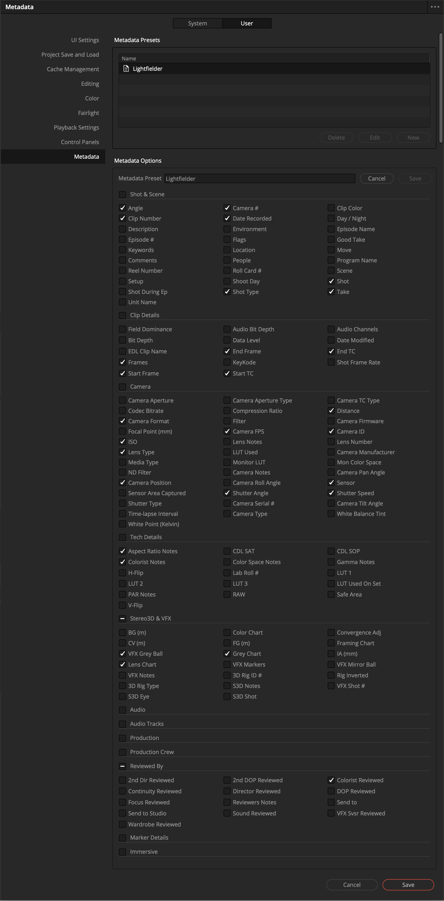

# Lightfielder | Metadata Tags

Resolve's Metadata system supports the use of presets that allow you to focus on specific fields that are relevant to a production.

## Metadata Options

In the Resolve Studio settings window you can toggle on the exact metadata fields you require. 

To do this, navigate to the "User" tab, then select the "Metadata" section on the left sidebar. This view allows you to create a new metadata preset using the "New" button, or modify an existing preset by selecting it from the list and pressing the "Edit" button.

The essential metadata attributes for volumetric video editing include:

### Shot & Scene:

- Angle
- Clip Number
- Reel Number
- Camera #
- Date Recorded
- Shot Type
- Scene
- Shot
- Take

### Clip Details:

- Frames
- Start Frame
- End Frame
- Start TC
- End TC
- Shot Frame Rate

### Camera:

- Camera Format
- Focal Point (mm)
- ISO
- Lens Type
- Camera Position
- Camera FPS
- Shutter Angle
- Distance
- Camera ID
- Camera Manufacturer
- Sensor
- Shutter Speed

### Tech Details:

- Aspect Ratio Notes
- Colorist Notes

### Stereo3D & VFX:

- VFX Grey Ball
- Lens Chart
- Grey Chart

### Reviewed By:

- Colorist Reviewed

## Metadata Checkboxes Enabled

Here is a screenshot of the metadata settings used:

