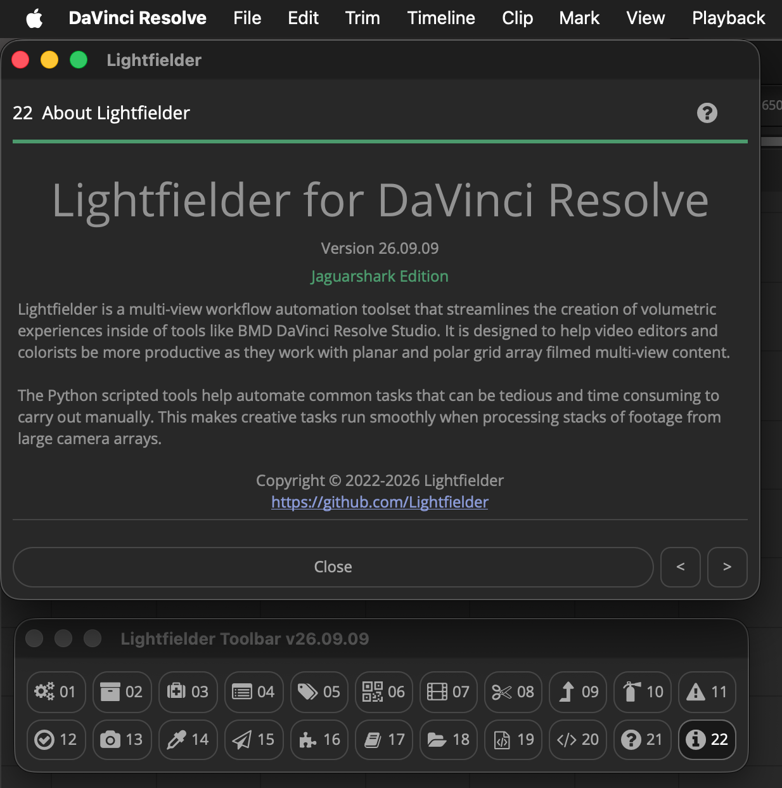

# Lightfielder v26.09.09 B1 for DaVinci Resolve

## Public Beta 1 Release

## Overview

Lightfielder is a multi-view workflow automation toolset that streamlines the creation of volumetric experiences inside of tools like BMD DaVinci Resolve Studio. It is designed to help video editors and colorists be more productive as they work with planar and polar grid array filmed multi-view content.

The Python scripted tools help automate common tasks that can be tedious and time consuming to carry out manually. This makes creative tasks run smoothly when processing stacks of footage from large camera arrays.

Note: Lightfielder also comes as a separate standalone app, and as a thin client. This self-hosted version is called [Lightfielder Ops](https://github.com/Lightfielder/LightfielderOperators). The Ops (Operators) software is now entering its initial private beta testing phase.

## GitHub Downloads

Go to the GitHub [Releases page](https://github.com/Lightfielder/Lightfielder-DaVinci-Resolve/releases) to access the latest build of Lightfielder.

## Free Open-Source License Terms

Lightfielder is cross-platform compatible and works across Linux, macOS, and Windows. The software is released under a permissive free open-source LPGPL/GPL license. Attribution is required and must be maintained on forks of the Lightfielder project's codebase and scripts. 

Note: The bundled sound effects were acquired with a license specifically for the Lightfielder/Kartaverse project so are not open-source/public domain licensed content.

## Example Projects

Additional learning content and example project files are being prepared for Lightfielder this month.

- [Pikachu Still Frame 50 View (A1-E5) ZIP Archive (300 MB)](https://we.tl/t-STJrEEaqnLC4tVGK)

## Accessing Lightfielder inside Resolve

The Lightfielder workflow automation scripts are accessed using the "Workspace \> Scripts \> Lightfielder \> " menu system, or the Lightfielder toolbar with the (Command + F11) hotkey.

## Table of Contents

- [ReadMe (You are here)](README.md)
- [ChangeLog](ChangeLog.md)
- [Known Issues](Known_Issues.md)
- [PunchList](PunchList.md)
- Deployment
 	- [Install Python](Install_Python.md)
	- [Install Lightfielder](Install_Lightfielder.md)
 	- [Uninstalling Lightfielder](Uninstall_Lightfielder.md)
- Usage
	- [Toolbar Scripts](Toolbar.md)
		- [00 Toolbar](Scripts_00_Toolbar.md)
		- [01 Preferences](Scripts_01_Preferences.md)
		- [02 Bin Templates](Scripts_02_Bin_Templates.md)
		- [03 Shotlog Pre-Flight](Scripts_03_Shotlog_PreFlight.md)
		- [04 Import Footage](Scripts_04_Import_Footage.md)
		- [05 Metadata Sync](Scripts_05_Metadata_Sync.md)
		- [06 Still Frames Export](Scripts_06_Still_Frames_Export.md)
		- [07 Create EDLs](Scripts_07_Create_EDLs.md)
		- [08 Batch Trim](Scripts_08_Batch_Trim.md)
		- [09 EDL Stack Swizzle](Scripts_11_EDL_Stack_Swizzle.md)
		- [10 EDL Checker](Scripts_09_EDL_Checker.md)
		- [11 Log Viewer](Scripts_10_Log_Viewer.md)
		- [12 Video Track Solo](Scripts_12_Video_Track_Solo.md)
		- [13 Camera Contact Sheet](Scripts_13_Camera_Contact_Sheet.md)
		- [14 Grade Automation](Scripts_14_Grade_Automation.md)
		- [15 EDL Export](Scripts_15_EDL_Export.md)
		- [16 Extensions](Scripts_16_Extensions.md)
		- [17 Edit Jupyter Link](Scripts_17_Jupyter_Link.md)
		- [18 Open Lightfielder Folder](Scripts_18_Open_Lightfielder_Folder.md)
		- [19 Show Console](Scripts_19_Show_Console.md)
		- [20 Documentation](Scripts_20_Documentation.md)
		- [21 Edit Python Module](Scripts_21_Edit_Python_Module.md)
		- [22 About Lightfielder](Scripts_22_About_Lightfielder.md)
	- [Metadata Tags](Metadata_Tags.md)
	- [Shotlog Format](Shotlog.md)
	- [Deliver Page Presets](Deliver_Page_Presets.md)
	- [Unit Tests](Unit_Tests.md)

## Workflow Guides

- [Lightfielder Live Grade Video Flowchart](Workflow_Guides/Lightfielder_Live_Grade_Flowchart.md)
- [Lightfielder HDR Image Based Rendering](Workflow_Guides/Lightfielder_HDR_Image_Based_Rendering.md)
- [Volumetric Color Decision Lists](Workflow_Guides/Volumetric_Color_Decision_Lists.md)
- [PBR-GS Physically Based Rendering of Gaussian Splats](Workflow_Guides/Physically_Based_Rendering_of_Gaussian_Splats.md)
