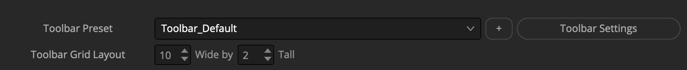

# Lightfielder | Scripts

## 00 Toolbar


The Lightfielder Toolbar cuts down the effort needed to access the "Workspace > Scripts > Lightfielder > " menu items. It acts as a launcher interface for starting the Resolve based Python scripts.

**Tip:** Hold down the shift key when clicking on a toolbar item to force-reload the script. This is handy if you have edited the script and want to refresh the view to show the changes.

**Tip:** When the Toolbar window "X" close box is clicked, if the shift modifier key is held down at the same moment, the extra floating palette windows are force-closed at the same time, too. This makes it a quick task to de-clutter your workspace if you need to focus on something else.

## Choosing a script editor

**Tip:** Hold down the Command (macOS) or Control (Win/Linux) key when clicking on a toolbar item to edit that Python script. This works if you have a script editor program defined in the Fusion page settings.

If you do not have a script editor defined, then Resolve will switch to the Fusion page, and display the Fusion settings window to allow you to customize the script editor preference.


A typical value for the Script editor filepath would be something like `/Applications/BBEdit.app` on macOS. On Linux workstations a Script editor filepath might be set to `/usr/bin/xed` or `/usr/bin/gedit`. On Windows you might choose to use a Script editor filepath that points to a copy of VS Code or Notepad++.

This feature requires the "xdg-open" package to be installed on Linux.

## User Editable JSON Toolbar Settings

The Lightfielder v26.09 update is in the middle of porting the toolbar configuration data from existing in a Python script over to using a new JSON based preset system. When the toolbar code migration is completed, it will allow the preferences window to swap the active Lightfielder toolbar from a combo menu, and the user defined configuration files will also be able to choose the exact tools and icons they would like to have in their custom shelves.



Shown below is visual example of a toolbar JSON system preset file. The data comes from the default `Toolbar_Default.json` file that is located at:  

`Lightfielder:/Resolve/Scripts/Utility/Lightfielder/Presets/Toolbars/Toolbar_Default.json`

The JSON based preset files allow you to customize every parameter used in the toolbar system on a per-tool level, and it also provides the ability to change the shape of the toolbar layout based upon the number of buttons displayed in a grid layout on the `width` and `height` axis.

```json
{
	"version": 1,
	"width": 11,
	"height": 2,
	"toolbar": {
		"tool1": {
			"icon": "fa-gear",
			"script": "Lightfielder:/Resolve/Scripts/Utility/Lightfielder/01 Preferences.py",
			"id": "PrefsWin",
			"text": "01",
			"tooltip": "01 Preferences"
		},
		"tool2": {
			"icon": "fa-archive",
			"script": "Lightfielder:/Resolve/Scripts/Utility/Lightfielder/02 Bin Templates.py",
			"id": "BinWin",
			"text": "02",
			"tooltip": "02 Bin Templates"
		},
		"tool3": {
			"icon": "fa-medkit",
			"script": "Lightfielder:/Resolve/Scripts/Utility/Lightfielder/03 Shot Validator.py",
			"id": "ShotlogPreFlightWin",
			"text": "03",
			"tooltip": "03 Shot Pre-Flight"
		},
		"tool4": {
			"icon": "fa-list-alt",
			"script": "Lightfielder:/Resolve/Scripts/Utility/Lightfielder/04 Import Footage.py",
			"id": "ImportFootageWin",
			"text": "04",
			"tooltip": "04 Import Footage"
		},
		"tool5": {
			"icon": "fa-tags",
			"script": "Lightfielder:/Resolve/Scripts/Utility/Lightfielder/05 Metadata Sync.py",
			"id": "MetadataWin",
			"text": "05",
			"tooltip": "05 Metadata Sync"
		},
		"tool6": {
			"icon": "fa-qrcode",
			"script": "Lightfielder:/Resolve/Scripts/Utility/Lightfielder/06 Still Frames Export.py",
			"id": "CalibrationWin",
			"text": "06",
			"tooltip": "06 Still Frames Export"
		},
		"tool7": {
			"icon": "fa-film",
			"script": "Lightfielder:/Resolve/Scripts/Utility/Lightfielder/07 Create EDLs.py",
			"id": "CreateEDLWin",
			"text": "07",
			"tooltip": "07 Create EDLs"
		},
		"tool8": {
			"icon": "fa-cut",
			"script": "Lightfielder:/Resolve/Scripts/Utility/Lightfielder/08 Batch Trim.py",
			"id": "TrimWin",
			"text": "08",
			"tooltip": "08 Batch Trim"
		},
		"tool09": {
			"icon": "fa-level-up",
			"script": "Lightfielder:/Resolve/Scripts/Utility/Lightfielder/11 EDL Stack Swizzle.py",
			"id": "EDLStackSwizzleWin",
			"text": "09",
			"tooltip": "09 EDL Stack Swizzle"
		},
		"tool10": {
			"icon": "fa-fire",
			"script": "Lightfielder:/Resolve/Scripts/Utility/Lightfielder/10 EDL Checker.py",
			"id": "EDLChecker",
			"text": "10",
			"tooltip": "10 EDL Checker"
		},
		"tool11": {
			"icon": "fa-triangle",
			"script": "Lightfielder:/Resolve/Scripts/Utility/Lightfielder/11 Log Viewer.py",
			"id": "LogViewerWin",
			"text": "11",
			"tooltip": "11 Log Viewer"
		},
		"tool12": {
			"icon": "fa-check-circle",
			"script": "Lightfielder:/Resolve/Scripts/Utility/Lightfielder/12 Video Track Solo.py",
			"id": "VideoTrackSoloWin",
			"text": "12",
			"tooltip": "12 Video Track Solo"
		},
		"tool13": {
			"icon": "fa-camera",
			"script": "Lightfielder:/Resolve/Scripts/Utility/Lightfielder/13 Camera Contact Sheet.py",
			"id": "CCSWin",
			"text": "13",
			"tooltip": "13 Camera Contact Sheet"
		},
		"tool14": {
			"icon": "fa-eyedropper",
			"script": "Lightfielder:/Resolve/Scripts/Utility/Lightfielder/14 Grade Automation.py",
			"id": "GradeAutomationWin",
			"text": "14",
			"tooltip": "14 Grade Automation"
		},
		"tool15": {
			"icon": "fa-paper-plane",
			"script": "Lightfielder:/Resolve/Scripts/Utility/Lightfielder/15 EDL Export.py",
			"id": "EDLExportWin",
			"text": "15",
			"tooltip": "15 EDL Export"
		},
		"tool16": {
			"icon": "fa-puzzle-piece",
			"script": "Lightfielder:/Resolve/Scripts/Utility/Lightfielder/16 Extensions.py",
			"id": "ExtensionsWin",
			"text": "16",
			"tooltip": "16 Extensions"
		},
		"tool17": {
			"icon": "fa-book",
			"script": "Lightfielder:/Resolve/Scripts/Utility/Lightfielder/17 Jupyter Link.py",
			"id": "JupyterWin",
			"text": "17",
			"tooltip": "17 Jupyter Link"
		},
		"tool18": {
			"icon": "fa-folder-open",
			"script": "Lightfielder:/Resolve/Scripts/Utility/Lightfielder/18 Open Lightfielder Folder.py",
			"id": "Docs",
			"text": "18",
			"tooltip": "18 Open Lightfielder Folder"
		},
		"tool19": {
			"icon": "fa-file-code-o",
			"script": "Lightfielder:/Resolve/Scripts/Utility/Lightfielder/19 Edit Python Module.py",
			"id": "Docs",
			"text": "19",
			"tooltip": "19 Edit Python Module"
		},
		"tool20": {
			"icon": "fa-file-code-o",
			"script": "Lightfielder:/Resolve/Scripts/Utility/Lightfielder/20 Console.py",
			"id": "fa-file-code-o",
			"text": "20",
			"tooltip": "20 Show Console"
		},
		"tool21": {
			"icon": "fa-code",
			"script": "Lightfielder:/Resolve/Scripts/Utility/Lightfielder/21 Documentation.py",
			"id": "Docs",
			"text": "21",
			"tooltip": "21 Documentation"
		},
		"tool22": {
			"icon": "fa-info-circle",
			"script": "Lightfielder:/Resolve/Scripts/Utility/Lightfielder/22 About Lightfielder",
			"id": "AboutWin",
			"text": "22",
			"tooltip": "22 About Lightfielder"
		}
	}
}
```
