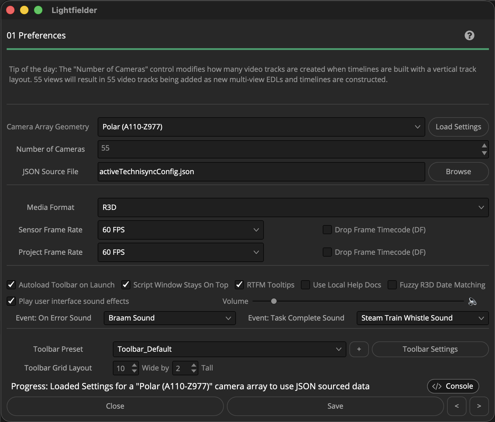

# Lightfielder | Scripts

## 01 Preferences

Allows you to change Lightfielder settings for attributes like rig geometry. This makes it possible to work with volumetric footage from the different eras of the camera array design.

Tip: The help "?" button at the top right of the window can be used to quickly show this help topic.

### Script Usage:

1. Open Resolve. Select the menu item: "Workspace > Scripts > Lightfielder > 01 Preferences" OR Select "Tool Bar" then click the "01" button.

2. Choose the settings you would like to use. The "Camera Array Geometry" ComboBox menu includes entries for:

- Planar Grid (A1-E5)
- Edge 3M (A1-E5)
- Polar (A100-Z997)

3. If the "Camera Array Geometry" Polar entry is selected, then a "JSON Source File" based filepath entry text field is displayed. Use the "JSON Source File" text field to select a .json formatted Technisync configuration file. The "Load Settings" button will refresh the "Number of Cameras" and frame rate values using the entries in the Technisync JSON file.

4. The "Number of Cameras" SpinBox control allows you to define how many cameras are present in the volumetric capture camera rig. This is typically a value from 50 to 55 that is related to the current "Camera Array Geometry" setting.

5. The "Media Format" ComboBox menu includes entries for:

- R3D
- Movie
- Image Sequence
- Still Frame

R3D support includes Red Digital Cinema and Nikon camera RED RAW R3D file types. Movie support includes Quicktime MOV, MP4, and MKV file types. Image Sequence and Still Frame image support includes: PNG, JPEG, EXR, DPX, and TIFF file types.

6. The "Drop Frame Timecode (DF) checkbox specifies if the frame rate is formatted as "24" vs "23.97" FPS. 

The "Sensor Frame Rate" control defines the frame rate present in the captured footage. The "Project Frame Rate" should match the Resolve Project and Timeline frame rate for most use cases. Both of these values can be loaded from the Technisync JSON file.

The sensor and project frame rate ComboBox menus include entries for:

- 24 FPS
- 25 FPS
- 30 FPS
- 48 FPS
- 50 FPS
- 60 FPS
- 90 FPS
- 100 FPS
- 120 FPS
- Custom

7. Click the "Save" button to continue.

The "Autoload Toolbar on Launch" checkbox tells the Lightfielder [Toolbar](Scripts_00_Toolbar.md) to open up automatically when DaVinci Resolve Studio starts. This is implemented "under the hood" using a new "`Scripts:/Lightfielder.scriptlib`" resource that allows Lightfielder to auto-configure itself when a new volumetric editing session is lauched. The ScriptLib approach provides deeper access to Resolve's internal action/event system hooks that can be used down the road with the new Lightfielder extension system.

The "RTFM Tooltips" checkbox provides more detailed help information that will save you a visit to the documentation for tool usage information. When the "RTFM Tooltips" checkbox is unchecked you will see very short tooltip messages that are concise.

The "Use Local Help" checkbox allows you to switch between displaying local on-disk help docs, and the GitHub repo hosted help docs.

The "Fuzzy R3D Date Matching" checkbox allows the Shotlog CSV date field to be considered a match with the R3D filename date value if they are within 1 day +/-.

The "Play user interface sound effects" checkbox allows the Lightfielder scripts to play sound effects when tasks are completed, or errors occur. There is a volume control, and you can specify if a sound effect should be played when python script events like "On Error" or "Task Completed" occur. You have the choice of selecting either "None", "Steam Train Whistle Sound", "Trumpet Sound", or "Braam Sound".

Note: There is a soft-limit on the Preference windows "Number of Cameras" SpinBox control maximum value that is set to 2048 camera views. This is applied mostly as a error-check to reduce accidental keyboard entry errors. If you wish to un-clamp that maximum input range for this setting, look in the Python script for the `"ID": "CameraArrayViewsSpinner"` entry and modify the `"Maximum": 2048,` number value.
