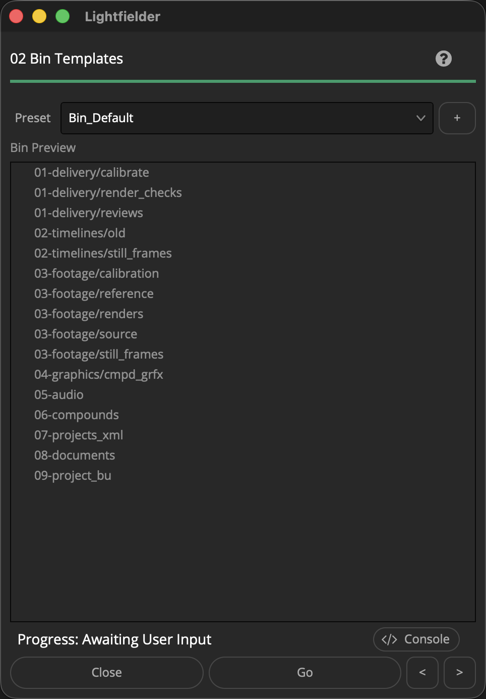

# Lightfielder | Scripts

## 02 Bin Templates

Quickly create Media page based Bin folders using pre-made templates.

Tip: The help "?" button at the top right of the window can be used to quickly show this help topic.

### Script Usage

1. Select the "Workspace > Script > Lightfielder > 02 Bin Template" menu item. A "Bin Template" window will appear • OR Select Tool Bar then click "02" button.

2. Use the "Preset" menu to select a Resolve project folder layout. The "Bin Preview" tree view shows what the folder structure will look like.

3. Click the "Go" button to make the Resolve Project folder structures.

### Create a New Preset:

1. You can create a new Bin preset from your current Media page Bin folder hierarchy by pressing the "+" button.

	This will snapshot the active Resolve bin folder structure and save it as a new preset.

2. A "Save Preset" dialog appears that allows you to name the preset.

3. The preset is saved as a .json format document into the folder location:

> `$HOME/Lightfielder/Resolve/Scripts/Utility/Lightfielder/Presets/Bins/`

If you want to delete a preset, simply remove the .json file from the presets folder.

The presets are saved as JSON formatted plain-text documents that can be viewed with a programmer's text editor. Each Bin folder path is entered on its own line and the path is wrapped inside a pair of quotes.
