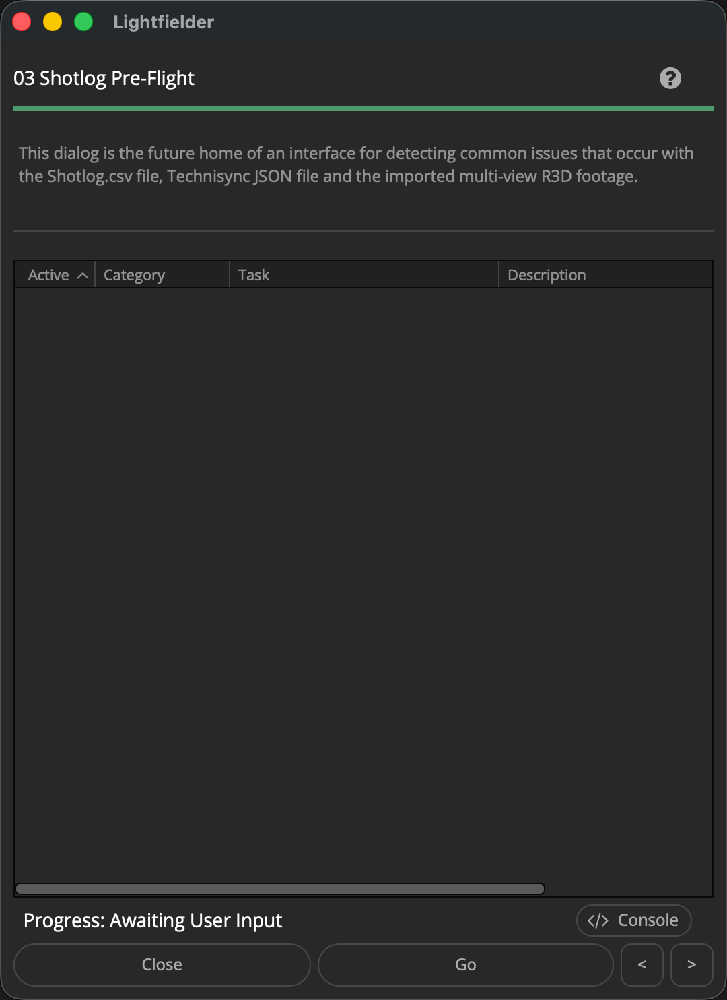

# Lightfielder | Scripts

## 03 Shotlog Pre-Flight

The pre-flight script detects common issues that occur with the Shotlog.csv file, Technisync JSON file and the imported multi-view R3D footage.

The script can optionally create a diagnostics package that adds a Media Pool CSV export to help catch issues with footage ingest and metadata tagging.

Tip: The help "?" button at the top right of the window can be used to quickly show this help topic.

**Note: This is a work-in-progress script. No dialog is displayed yet when the script is run.**

### Script Usage:

1. Open Resolve. Select the menu item: "Workspace > Scripts > Lightfielder > 03 Shotlog Pre-Flight" • OR Select Tool Bar then click "03" button.

2. Click the "Validate..." button to scan for issues. A report will be shown in the future once this tool is completed.

## Things to Validate

- Validate project frame rate (24 vs 29.97) is the same as the footage frame rate (29.97). Otherwise an offset will exist.
- Validate project resolution matches the timeline resolution, and the .R3D clip resolution
- Check if the files have read permissions issues, or a 0 KB file size on disk
- Check if there are .R3D file decoding issues and that the file is valid
- Check if any of the R3D clip filename date codes had their internal clock roll over the 24 hour day boundary period so they are "off by one" compared to the date entry in the Shotlog.csv file
- Check if the R3D clips "Clip Number" tag fails to match any of the Shotlog.csv records
- Check if the .R3D files have doubled up file extensions like ".R3D.R3D"
- Check if the .R3D files or folders start with an invisible character like a "." period or "._".
- Check if the Shotlog.csv file has invalid comma separated formatting
- Check if the Technisync JSON file has valid syntax
- Check if there are zero .R3D items in the footage folder that match the Shotlog.csv file entries when attempting to import footage to the media pool
- Check if there are zero .R3D items in the Media Pool that match the Shotlog.csv and Technisync JSON records when attempting to apply metadata tags to the clips

- Check if the Technisync JSON records for the Polar convention exceeds A-Q or A-R or A-Z specs. Also check if there are less than 50 cameras or more than 55 cameras in the JSON file entries.
- Check if the Lightfielder preferences "Number of Cameras" setting lines up with the actual number of clips imported for each take into the Media Pool.
- Check if there are .R3D timecode inconsistencies in the Start TC and End TC values for the footage. This would indicate Genlock sync issues, or strange mis-matched clip filename/metadata issues that means footage was likely intermixed from different takes.
- Check if video footage in an editing timeline has frozen (held) "Edit Index" values on the Edit page. This would mean the video doesn't playback at full motion frame rates.
- Check if the Deliver page presets for Calibration, Post-Calibration, HDRI, and Content have been imported already
