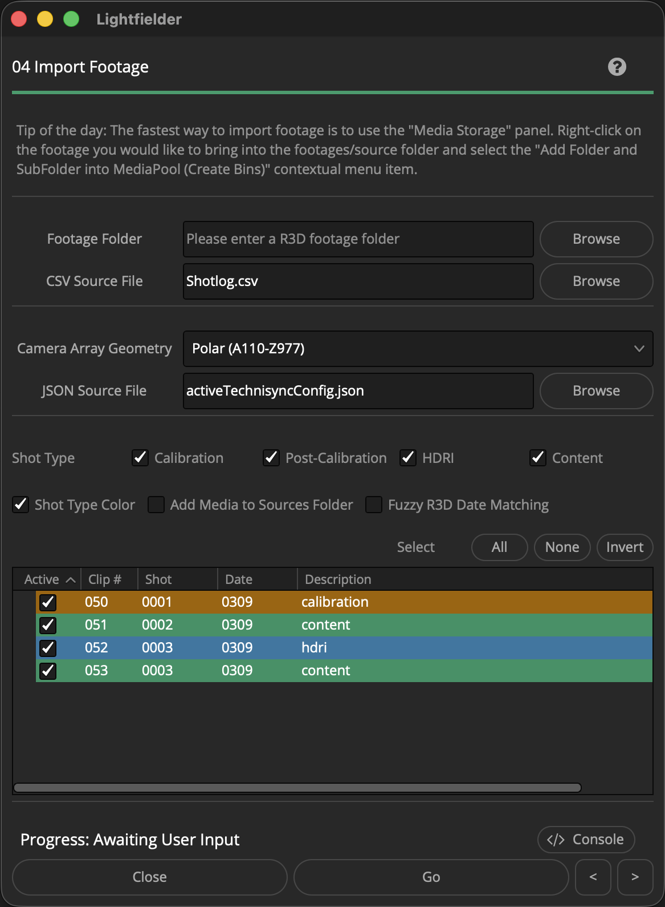

# Lightfielder | Scripts

## 04 Import Footage

Import R3D footage into the Resolve media page.

Tip: The help "?" button at the top right of the window can be used to quickly show this help topic.

### Script Usage:

1. Create a new Resolve project and add the Bin folder structure you desire. Copy a shotlog.csv file into the on-disk project folder hierarchy. A good place to store a shotlog file might be the "08_Documents" folder.

2. Select the menu item: "Workspace > Scripts > Lightfielder > 04 Import Footage" • OR Select Tool Bar then click "04" button.

3. Use the "CSV Source File" text field to select a .csv (Comma Separated Value) formatted shotlog file. Use the "Footage Folder" text field to select a R3D footage folder.

4. If the "Camera Array Geometry" Polar entry is selected, then a "JSON Source File" based filepath entry text field is displayed. Use the "JSON Source File" text field to select a .json formatted Technisync configuration file.

5. The "Shot Type" checkboxes let you globally enable/disable takes based upon the Shotlog.csv description field content. The tree view's "Active" checkbox column lets you enable the processing of individual takes. The Select "All", "None", and "Invert" buttons allow you to quickly toggle the Tree view selection.

6. Press the "Go" button to process the data.
