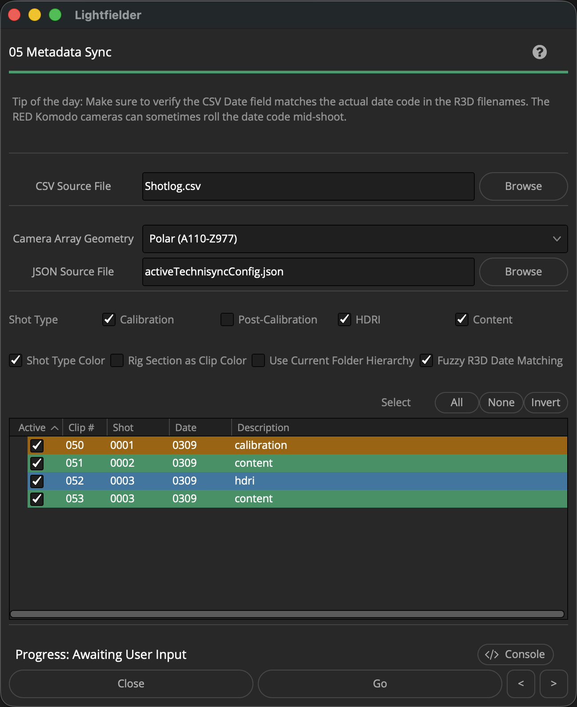
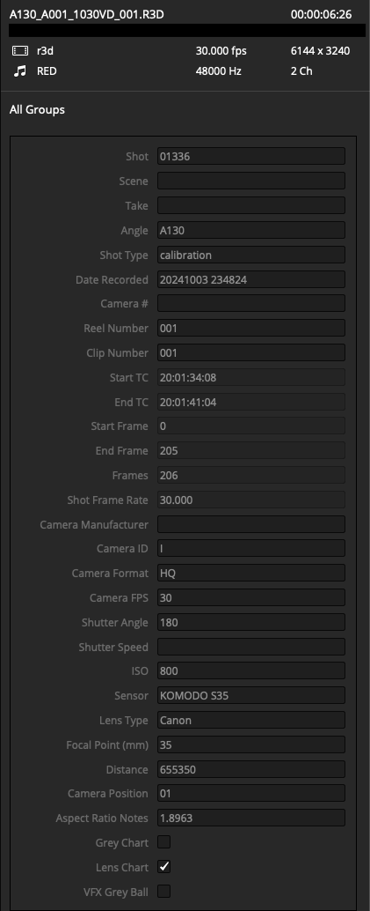
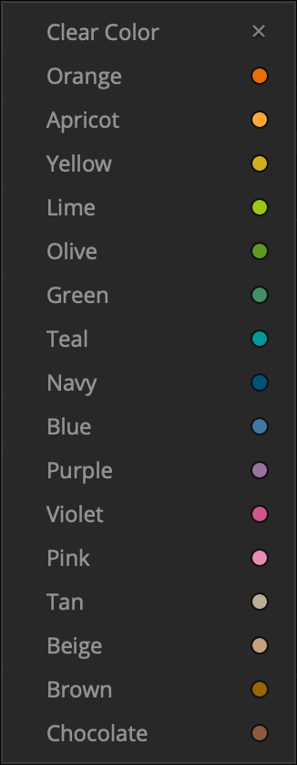
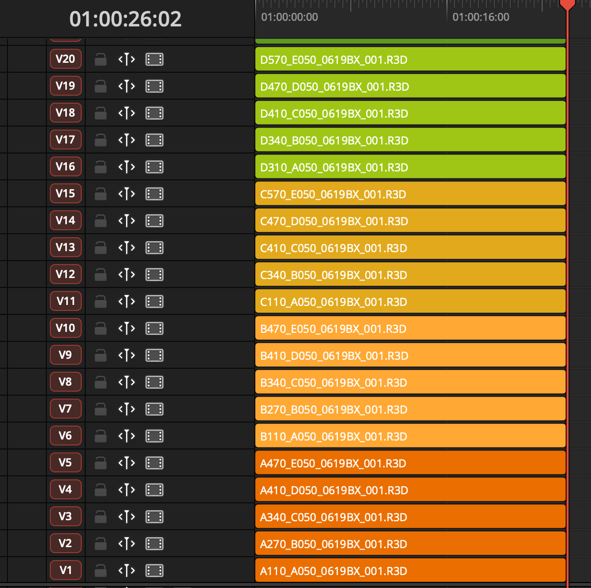

# Lightfielder | Scripts

## 05 Metadata Sync

Add metadata to existing clips in the media pool. This data is sourced from the shotlog (.csv) and the clip level .r3d filename.

Tip: The help "?" button at the top right of the window can be used to quickly show this help topic.

### Script Usage:

1. Create a new Resolve project and add the Bin folder structure you desire. Copy a shotlog.csv file into the on-disk project folder hierarchy. A good place to store a shotlog file might be the "08_Documents" folder.

2. Select the menu item: "Workspace > Scripts > Lightfielder > 05 Metadata Sync" • OR Select Tool Bar then click "05" button.

3. Use the "CSV Source File" text field to select a .csv (Comma Separated Value) formatted shotlog file.

4. If the "Camera Array Geometry" Polar entry is selected, then a "JSON Source File" based filepath entry text field is displayed. Use the "JSON Source File" text field to select a .json formatted Technisync configuration file.

5. Choose the media pool "Shot Type" that you would like to have clip level metadata added to. Options include "Calibration", "Post-Calibration", "HDRI", and "Content".

6. Press the "Go" button to process the data.

### Clip Metadata

The following Resolve Media page clip-level metadata records are populated from the shotlog.csv and R3D filename by the Metadata Sync Python script:

| Category | Value / Range | System Reference |
| --- | --- | --- |
| Angle | AA-JE or A110-Z997 | CCS View |
| Camera Position | 01-50 | CCS View Number |
| Clip Number | 001-999 | Shotlog Clip ID |
| Description | "calibration", "hdri", or content description | Shotlog Description |
| Shot Type | "calibration", "hdri", "content" | Shotlog Description |
| Shot | 0001-9999 | Shotlog Shot ID |
| VFX Grey Ball | 0-1 | Shotlog Description "hdri" |
| VFX Mirror Ball | 0-1 | Shotlog Description "hdri" |
| Lens Chart | 0-1 | Shotlog Description "calibration" |

This is an example of a R3D file with metadata tags added to the clip in the Resolve media pool:

## Rig Section

The "Rig Section as Clip Color" checkbox allows you to colorize the clips as they appear in the Media Pool and the Editing timeline. The actual parameter is stored on the Media Pool clip. Then when the timeline is created later on the clip color is inherited by the footage at timeline levelm too. 

This process works by applying the first letter from the camera rig "A1-EJ" or "A110-Z997" style angle parameter as the index number for cycling through DaVinci Resolve's "clip color" palette. The end result is that each region of the camera array rig sections like "A - Z" get a unique color for their block of cameras.

This approach for rig section visualization rapidly speeds up how fast you can eye-ball check for missing views in a timeline as the colors help to "batch together" the groups of views by their specific hue / color swatch.

This is the available clip color palette:  

This is what it looks like when the  "Rig Section as Clip Color" checkbox is enabled and an editing timeline is constructed:  

