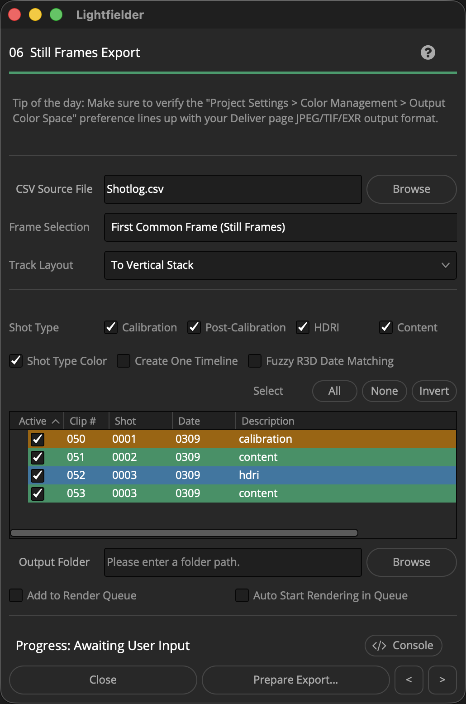

# Lightfielder | Scripts

## 06 Still Frames Export

Prepares a new Delivery page render job for "Individual Clip" mode based output.

Tip: The help "?" button at the top right of the window can be used to quickly show this help topic.

### Script Usage:

1. Open Resolve. Select the menu item: "Workspace > Scripts > Lightfielder > 06 Still Frames Export" • OR Select Tool Bar then click "06" button.

2. Use the "CSV Source File" text field to select a .csv (Comma Separated Value) formatted shotlog file.

3. The "Frame Selection" control allows you to modify the duration of the content as it is added to the timeline. The default option of "First Common Frame (Still Frames)" aligns the in-point of each clip in the timeline while also trimming them down to a single frame duration.

4. The "Track Layout" ComboBox menu item allows you to select between a "To Vertical Stack" or "To Horizontal Stack" option. This defines the track orientation used when multi-view content is added to the new timelines.

5. The "Shot Type" checkboxes let you globally enable/disable takes based upon the Shotlog.csv description field content. Select if the shot type is either a "Calibration", "Post-Calibration", "HDRI", or "Content" output. The tree view's "Active" checkbox column lets you enable the processing of individual takes. The Select "All", "None", and "Invert" buttons allow you to quickly toggle the Tree view selection.

6. The "Output Folder" text field allows you to define the output location where the images will be saved. The Browse button displays a folder selection dialog. Clicking on the "Output Folder" text label opens up a desktop folder browsing window to the output location.

7. Click the "Prepare Export…" button to prepare a new timeline for single-frame duration output. You will be brought to the Delivery page where you can validate the export settings you would like to use. 

	The custom Deliver page "Calibration" render setting is selected automatically. It allows exporting footage in an "individual clips" based output mode where each clip of RED footage will have a single JPEG image saved to a separate file on disk.

	or

	The custom Deliver page "HDRI" render setting is selected automatically. It allows exporting footage in an "individual clips" based output mode where each clip of RED footage will have a single EXR image saved to a separate file on disk.

	The Deliver page output presets are defined in the Lightfielder provided "Calibration.xml", "Post-Calibration.xml", "HDRI.xml" and "Content.xml" files. If you do not wish to install the XML files then you will need to manually recreate it.
