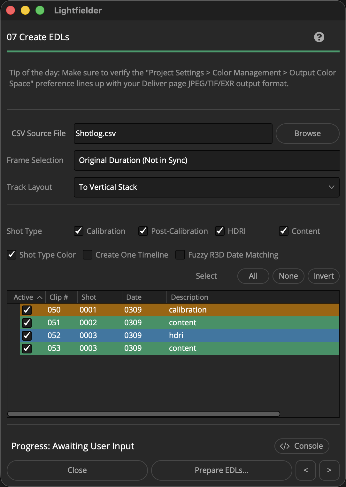
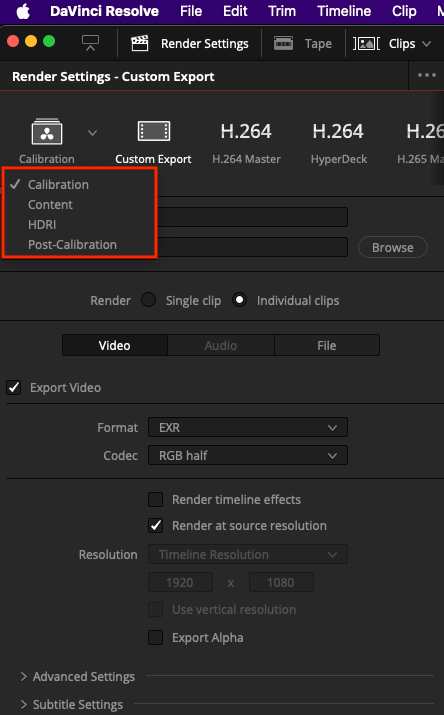

# Lightfielder | Scripts

## 07 Create EDLs

Creates new editing timelines with the multi-view content placed vertically across many tracks, or in a single horizontal track.

Tip: The help "?" button at the top right of the window can be used to quickly show this help topic.

**Note: The "Frame Selection" "Original Duration (Not in Sync)" option, and the various "First/Middle/Last Common Frame (Still Frames)" options should work correctly. The other options result in a video freeze-frame effect in the Edit page. The entries with known issues in Resolve Studio v20 and v21 are "Minimal Timecode Sync" and the various "(10 Seconds)" options. The Edit Index view shows the root issue at hand.**

### Script Usage:

1. Open Resolve. Select the menu item: "Workspace > Scripts > Lightfielder > 07 Create EDLs" • OR Select Tool Bar then click "07" button.

2. Use the "CSV Source File" text field to select a .csv (Comma Separated Value) formatted shotlog file.

3. The "Frame Selection" control allows you to modify the duration of the content as it is added to the timeline. The default option of "Original Duration (Not in Sync)" preserves each clip's in/out point range without performing any trimming.

4. The "Track Layout" ComboBox menu item allows you to select between a "To Vertical Stack" or "To Horizontal Stack" option. This defines the track orientation used when multi-view content is added to the new timelines.

5. The "Shot Type" checkboxes let you globally enable/disable takes based upon the Shotlog.csv description field content. Select if the shot type is either a "Calibration", "Post-Calibration", "HDRI", or "Content" output. The tree view's "Active" checkbox column lets you enable the processing of individual takes. The Select "All", "None", and "Invert" buttons allow you to quickly toggle the Tree view selection.

6. Click the "Prepare EDLs…" button to prepare new timelines.

7. When you go to export your finished edited and color graded content, the Resolve Deliver page uses a set of export presets that are paired against the shot type:

- Calibration
- Post-Calibration
- Content
- HDRI

The Deliver page presets allow custom filename tokens to be defined that access clip level metadata values when building the final filenames.

At any time the Deliver page presets can be edited, and those changed settings are used on the next export job.

