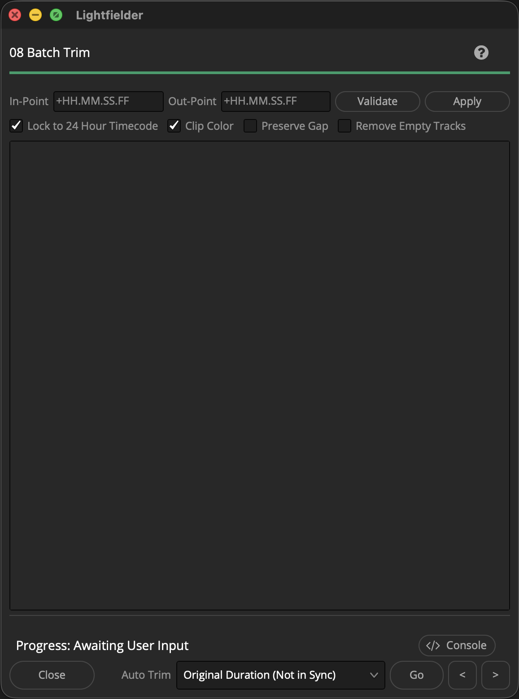

# Lightfielder | Scripts

## 08 Batch Trim

Apply a Batch Trim to all of the clips in a timeline.

Tip: The help "?" button at the top right of the window can be used to quickly show this help topic.

**Note: The Batch Trim "Original Duration (Not in Sync)" option, and the various "First/Middle/Last Common Frame (Still Frames)" options should work correctly. The other options result in a video freeze-frame effect in the Edit page. The entries with known issues in Resolve Studio v20 and v21 are "Minimal Timecode Sync" and the various "(10 Seconds)" options. The Edit Index view shows the root issue at hand.**

### Script Usage:

1. Open a Resolve Edit page based timeline. Select the menu item: "Workspace > Scripts > Lightfielder > 08 Batch Trim" • OR Select Tool Bar then click "08" button.

2. Enter your In-Point and Out-Point values using "+10" for ten frames, "+10." for 10 seconds, and "+10.." for ten minutes.

3. Press the "Validate" button to check if enough frame handles exist on the footage in the timeline.

4. Press the "Apply" button to perform the edit.
