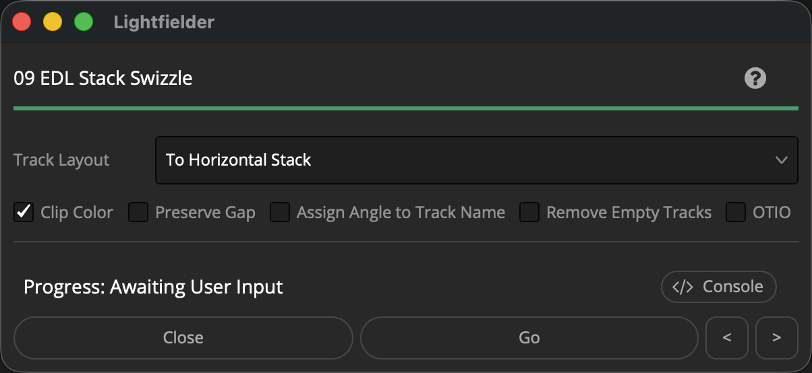

# Lightfielder | Scripts

## 09 EDL Stack Swizzle

Converts a multi-view video track layout between a horizontal stack (HStack) and vertical stack (VStack) timeline format.

Tip: The help "?" button at the top right of the window can be used to quickly show this help topic.

### Script Usage:

1. Open Resolve. Select the menu item: "Workspace > Scripts > Lightfielder > 09 EDL Stack Swizzle" OR Select Tool Bar then click "09" button.

2. The "Convert Track" ComboBox menu item allows you to select between a "To Vertical Stack" or "To Horizontal Stack" option.

3. Click on the "Go" button to generate a new OpenTimelineIO formatted VSTACK or HSTACK timeline output. A status dialog will show the clips that were processed when creating the new timeline.

### Relinking Media:

If the imported OTIO based vertically stacked timeline has clips listed as "Media Offline" that can be solved using the Media page. Right click on the imported "VStack" or "HStack" timeline, and select the "Timelines > Reconform From Bins…" menu item.

In the "Conform from Bins" dialog enable the "Conform Options" you prefer. For OTIO timeline based clip relinking, a good initial choice is to enable the "File Name" checkbox.

Select the Conform Bins on the left where your footage is stored in the media pool. Then click the OK button.

If the relinking process succeeded, the footage in your timeline should be loaded and the clips will have a blue color.
