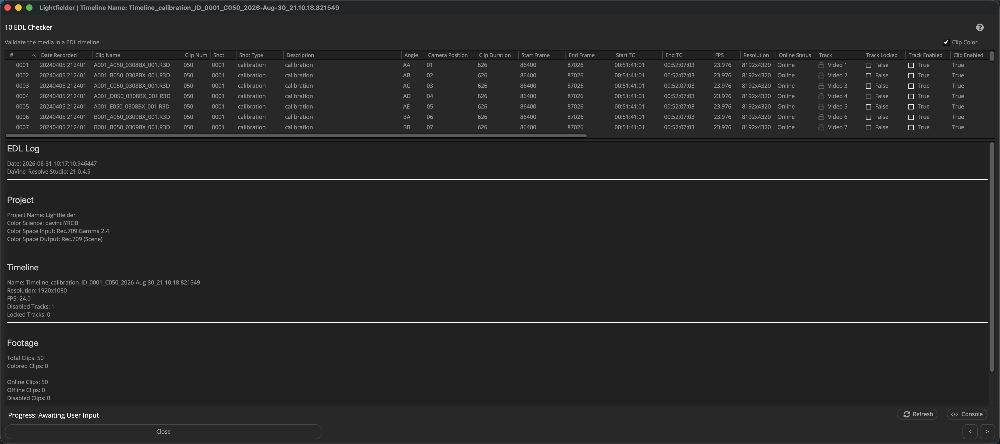

# Lightfielder | Scripts

## 10 EDL Checker

Quickly spot issues with a timeline before a long render is started.

Tip: The help "?" button at the top right of the window can be used to quickly show this help topic.

### Script Usage:

1. Open Resolve. Select the menu item: "Workspace > Scripts > Lightfielder > 10 EDL Checker" • OR Select Tool Bar then click "10" button.

2. This window allows you to quickly find issues with the editing timeline such as camera angle metadata problems, timecode issues, and unususal timeline settings.
