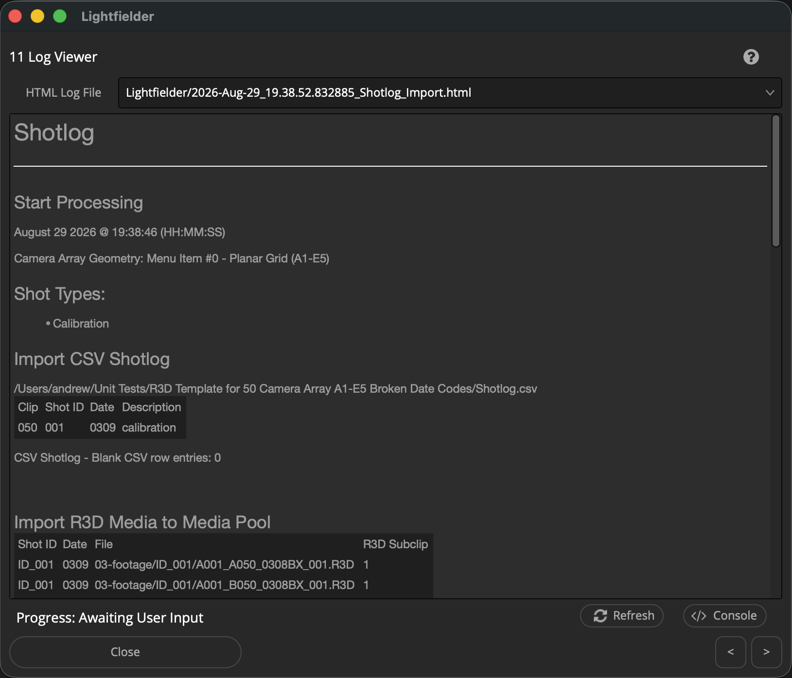

# Lightfielder | Scripts

## 11 Log Viewer

Open the Lightfielder HTML logfiles for review.

The Log files are saved to:

	$HOME/Lightfielder/Logs/Projects/

The individual log files are .html documents that have the filename start with a date code like "`2026-Mar-27_15.28.49.657349_Shotlog_Import.html`". This date code corresponds with "YYYY-MMM-DD_HH.MM.SS.SSSSSS". Colons are avoided in the timestamp used in the filename as they create filepath issues on cross-platform filesystems.

Tip: The help "?" button at the top right of the window can be used to quickly show this help topic.

**Note: Clicking the "HTML Log File" text label will automatically open up the folder location of the selected log file. If no log file is present then nothing will happen.**

### Script Usage:

1. Open Resolve. Select the menu item: "Workspace > Scripts > Lightfielder > 11 Log Viewer" • OR Select Tool Bar then click "11" button.

2. Choose the Log you would like to review.
