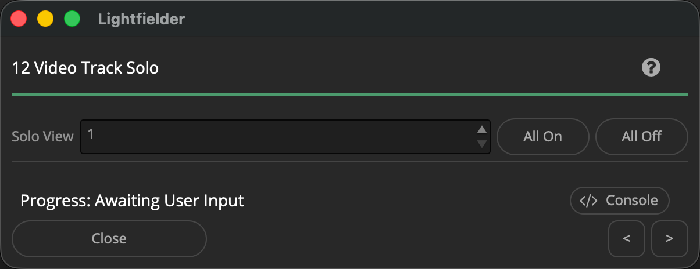

# Lightfielder | Scripts

## 12 Video Track Solo

Solo a video track in the Edit page.

Tip: The help "?" button at the top right of the window can be used to quickly show this help topic.

### Script Usage:

1. Open a Resolve Edit page based timeline. Select the menu item: "Workspace > Scripts > Lightfielder > 12 Video Track Solo" • OR Select Tool Bar then click "12" button.

2. The Stack Solo script has a Solo View "SpinBox" control with a number input field and up/down arrows that let you navigate between the 50 camera views. 

A video track that is disabled has a red colored filmstrip icon with a diagonal slash through it. The enabled video track is shown with a gray colored filmstrip icon.

3. If you click in the "Solo View" input field in the Stack Solo script you can use the up/down cursor keys to cycle the values. The mouse scroll wheel can also be used to cycle the values if you place the cursor pointer over the "Solo View" input field.

You can also toggle the enabled/disabled state of all video tracks with the "All On" and "All Off" Buttons.
