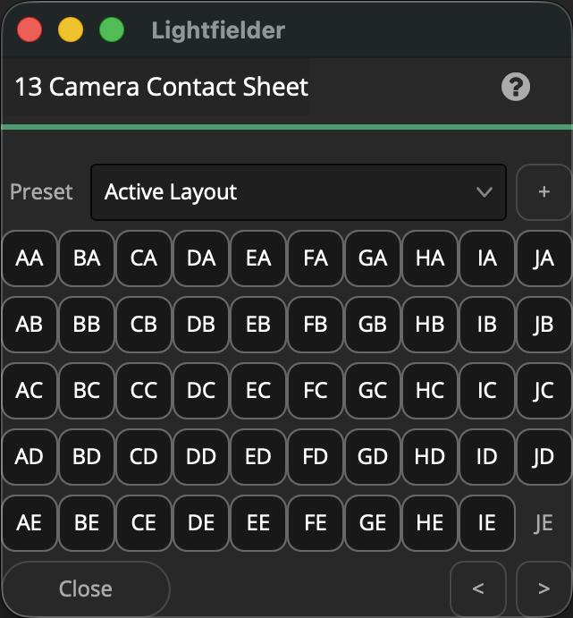
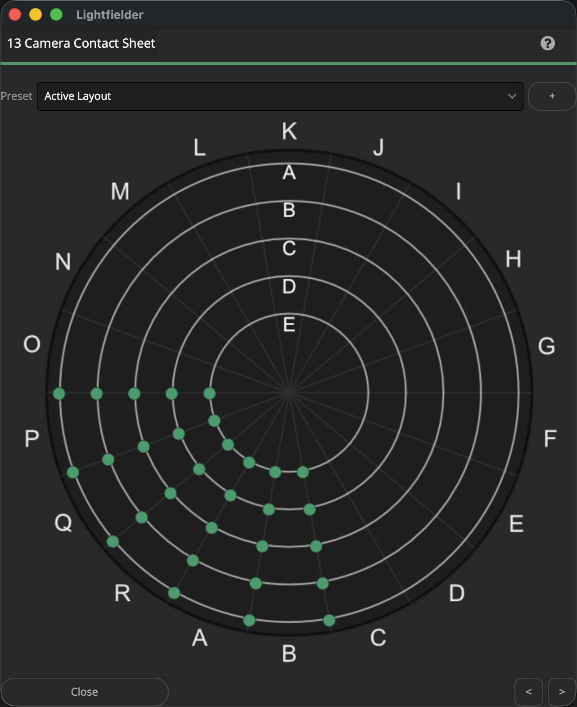

# Lightfielder | Scripts

## 13 Camera Contact Sheet

Control the visibility of the CCS (Camera Contact Sheet) views. This window acts as a camera array layout preview window which helps you understand the relationship between the physical camera names and the clip layout in the timeline.

Tip: The help "?" button at the top right of the window can be used to quickly show this help topic.

### Rect

The rect version of the Camera Contact Sheet window was created for use with the earlier "Planar Grid (AA-EJ)" and "Edge 3M (AA-EJ)" camera arrays.

Array Preset Location:
`$HOME/Lightfielder/Resolve/Scripts/Utility/Lightfielder/Presets/Array/`

Toggling camera views On/Off in this window functions like a multitrack version of the stack solo script.

#### Script Usage:

1. Open a Resolve Edit page based timeline. Select the "Workspace > Script > Lightfielder > 13 Camera Contact Sheet" menu item • OR Select Tool Bar then click "13" button.
   A "Camera Contact Sheet" window will appear.

2.  Use the "Preset" menu to select from a list of pre-saved camera layouts.

When you customize the CCS view by toggling On/Off individual cameras, the Preset entry will change to the state labelled "Active Layout".

If you would like to enable a quick preset that has zero cameras selected choose the "Array_Default" entry.

The initial Preset list includes the following entries listed below.

- Array_Center_Box
- Array_Boxes
- Array_Center_Star
- Array_Center_Target
- Array_Center
- Array_Checkerboard_A
- Array_Checkerboard_B
- Array_Column_A
- Array_Column_B
- Array_Default
- Array_Edge_4
- Array_Edge_9_Center_Star
- Array_Edge_9
- Array_Everything_Off
- Array_Everything_On
- Array_Row_A
- Array_Row_B
- Array_VistaView_3
- Array_VistaView_5

3. If you are on the Edit, Color, or Deliver page, using the CCS window presets will auto-toggle the available clips. This allows you to quickly modify which views are rendered to disk on the Deliver page. You can also target color grading to specific views on the color page via the CCS window.

#### Create a New Preset:

1. You can create a new Camera Contact Sheet preset by pressing the "+" button.

2. A "Save Preset" dialog will appear that allows you to name the preset.

3. The preset is saved as a .json document in the folder location:
`$HOME/Lightfielder/Resolve/Scripts/Utility/Lightfielder/Presets/Array/`

If you want to delete a preset, simply remove the .json file from the presets folder.

The presets are saved as JSON formatted plain-text documents. For a preset, each of the active camera array buttons that are pressed down in the CCS window, has an entry listed in the JSON file on its own line that is wrapped inside a pair of quotes. The array entries can range between "AA - "JE" for a 50 view rig. 

### Polar

A polar version of the Camera Contact Sheet window is still under development for use with the "Polar (A100-Z997)" camera array geometry.

