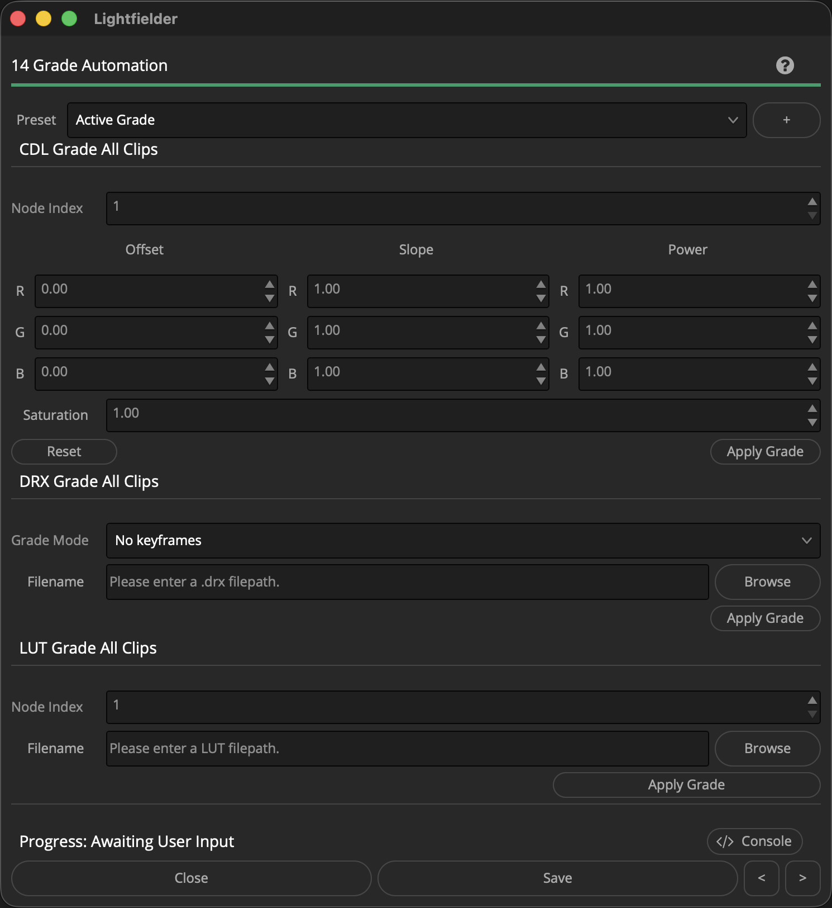

# Lightfielder | Scripts

## 14 Grade Automation

The Grade Automation view allows you to apply CDL/DRX/LUT grades to the multi-view clips in a timeline.

Tip: The help "?" button at the top right of the window can be used to quickly show this help topic.

### Script Usage:

1. Open a Resolve Edit page based timeline. Select the menu item: "Workspace > Scripts > Lightfielder > 14 Grade Automation" • OR Select Tool Bar then click "14" button.

2. Apply a combination of CDL, DRX, and LUT grades to your footage. When applying a CDL Grade, clicking the Offset/Slope/Power labels will reset the values. Clicking on individual "R", "G", or "B" channel labels will reset those specific channel values.

3. If you want to apply view-dependent grading changes, the "CCS" Camera Contact Sheet script can be used to target the specific camera views that will have grading operations applied to the clips.

4. Press the individual "Apply Grade" buttons in the user interface to see the results of your changes.

### Create a New Preset:

1. You can create a new grading preset by pressing the "+" button. This will snapshot the active settings from the window and save it as a new preset.

2. A "Save Preset" dialog will appear that allows you to name the preset.

3. The preset is saved as a .json format document into the folder location:

`$HOME/Lightfielder/Resolve/Scripts/Utility/Lightfielder/Presets/Grade/`

If you want to delete a preset, simply remove the .json file from the presets folder.

The presets are saved as JSON formatted plain-text documents that can be viewed with a programmer's text editor. Each grade preset is entered on its own line. Number values are entered directly, while values like file paths are wrapped in double quotes.
