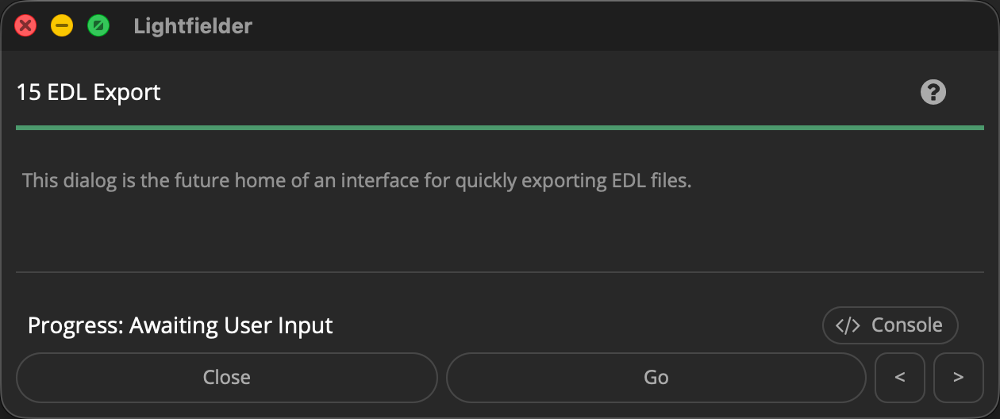

# Lightfielder | Scripts

## 15 EDL Export

Prepares a new Delivery page render job for "Individual Clip" mode based output.

Tip: The help "?" button at the top right of the window can be used to quickly show this help topic.

**Note: This is a work-in-progress script. The dialog does not perform any useful functions yet when the script is run.**

### Script Usage:

1. Open Resolve. Select the menu item: "Workspace > Scripts > Lightfielder > 15 EDL Export" • OR Select Tool Bar then click "15" button.

2. Choose the settings you would like to use.

3. Click the "Go" button to continue.
