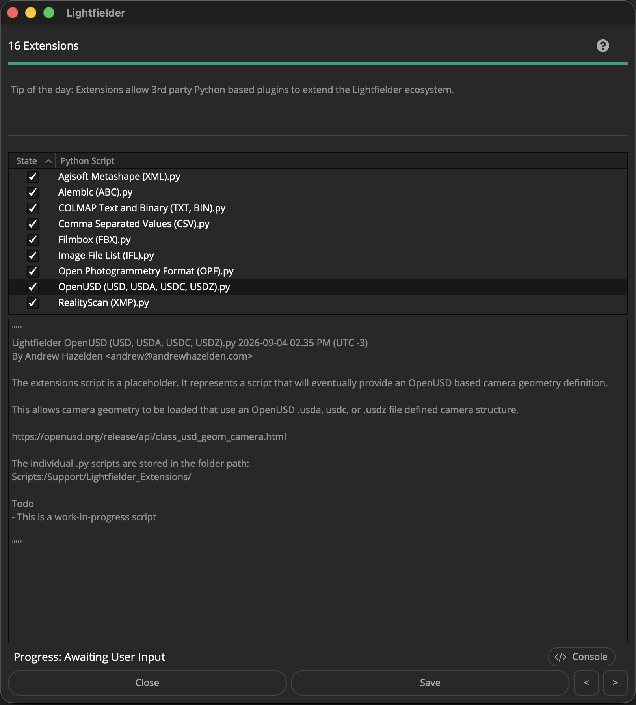

# Lightfielder | Scripts

## 16 Extensions

Extensions allow 3rd party Python based plugins to extend the Lightfielder ecosystem.

The individual .py scripts are stored in the folder path:  
`Scripts:/Support/Lightfielder_Extensions/`

Tip: The help "?" button at the top right of the window can be used to quickly show this help topic.

**Note: This is a work-in-progress script. The user interface is still a placeholder.**

### Script Usage:

1. Open Resolve. Select the menu item: "Workspace > Scripts > Lightfielder > 16 Extensions" • OR Select Tool Bar then click "16" button.

2. Clicking on a script in the tree view allows you to see the Python script contents in the lower part of the window.

3. Turning ON/OFF the checkbox next to a script item in the Tree view allows you to enabled/disable the script inside of Lightfielder.

### Python Extensions API

The Lightfielder extension systems is based upon reference code donated by Jacob Danell, a compositing technical director who runs [EmberlightVFX](https://github.com/EmberLightVFX) in Sweden. Jacob improved the plugin interface for a Nuke to Resolve/Fusion node conversion toolset called [Nusion](https://lightfielder.github.io/NusionCompConverter/#/adding_nodes).

### I/O File Formats

A goal with the extension system is to add support for a wider range of camera rig data interchange formats including:
- [Agisoft Metashape (XML)](https://github.com/agisoft-llc/metashape-scripts)
- [Alembic (ABC)](https://www.alembic.io/)
- [COLMAP Text and Binary (TXT, BIN)](https://colmap.github.io/format.html)
- [Comma Separated Values (CSV)](https://en.wikipedia.org/wiki/Comma-separated_values)
- [Filmbox (FBX)](https://www.autodesk.com/products/fbx/overview)
- [Image File List (IFL)](https://help.autodesk.com/view/3DSMAX/2024/ENU/?guid=GUID-CA63616D-9E87-42FC-8E84-D67E1990EE71)
- [OpenUSD (USD, USDA, USDC, USDZ)](https://openusd.org/release/api/class_usd_geom_camera.html)
- [Open Photogrammetry Format (OPF)](https://pix4d.github.io/opf-spec/)
- [Reality Capture/RealityScan (XMP)](https://rshelp.capturingreality.com/en-US/tools/xmpalign.htm)
