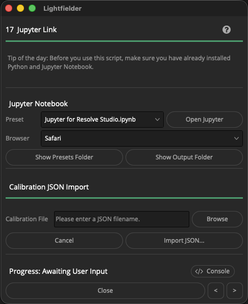
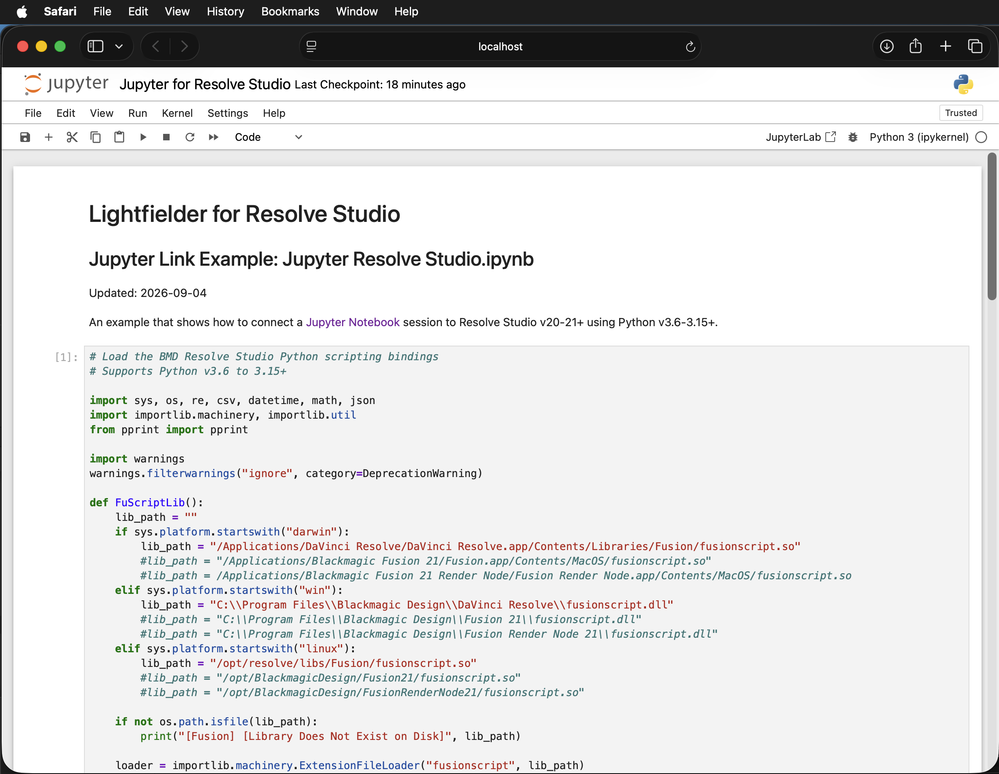

# Lightfielder | Scripts

## 17 Jupyter Link

Connects the active Resolve Studio session with the Jupyter Notebook IDE using Python. This allows Jupyter to read data live from the Resolve project, and remote-control any Resolve scripting API function.

Tip: The help "?" button at the top right of the window can be used to quickly show this help topic.

The default Jupyter file is located at:  
`Scripts:/Utility/Lightfielder/Presets/Calibration/Jupyter Resolve Studio.ipynb`

### Script Usage:

1. Open Resolve. Select the menu item: "Workspace > Scripts > Lightfielder > 17 Jupyter Link" • OR Select Tool Bar then click "17" button.

2. Choose the preset you would like to use. You should like start with the "`Jupyter for Resolve Studio.ipynb`" menu entry if this is your first time using Jupyter Link. 

3. Use the "Browser" menu item to choose the web browser to run the Jupyter session with. Options include Safari (macOS), Firefox, and Chrome. It is possible to add more browsers like Edge, etc if desired.

4. Click the "Open Jupyter..." button to continue.

### Example Notebook

The included Jupyter Notebook example file nows support Python v3.6 - 3.15+ though the use of the importlib Python module.

The initial Jupyter Link notebook preset is located on disk at: "`Lightfielder:/Resolve/Scripts/Utility/Lightfielder/Presets/Jupyter/Jupyter for Resolve Studio.ipynb`"

