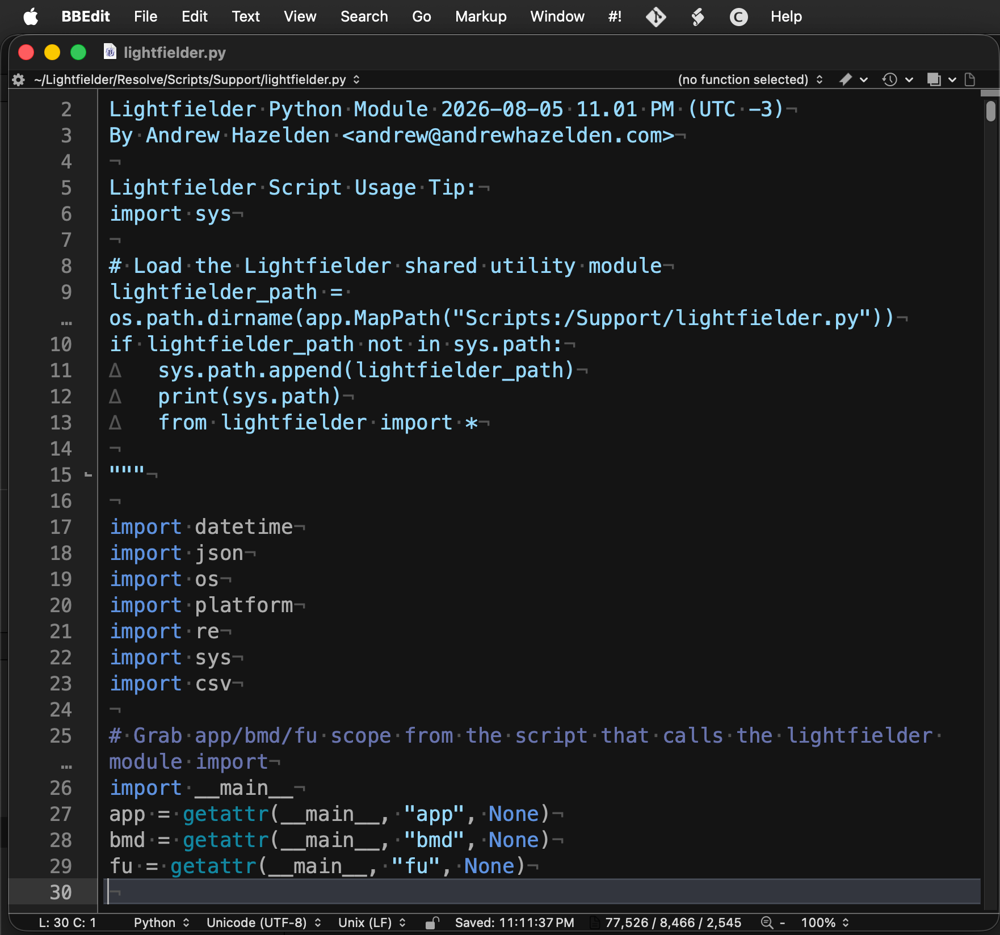

# Lightfielder | Scripts

## 19 Edit Python Module

This script opens the "`Scripts:/Support/lightfielder.py`" PathMap which typically expands to the relative folder UNIX path of:  

> `$HOME/Lightfielder/Resolve/Scripts/Support/lightfielder.py`

Tip: This feature requires the "xdg-open" package to be installed on Linux.

### Script Usage:

1. Open Resolve. Select the menu item: "Workspace > Scripts > Lightfielder > 19 Edit Python Module" • OR Select Tool Bar then click "19" button.

2. If you have a script editor program defined in the Fusion page settings, this program will be used to edit the Lightfielder Python module script file when this toolbar item is run.

	If you do not have a script editor defined, then Resolve will switch to the Fusion page, and display the Fusion settings window to allow you to customize the script editor preference.

	

	A typical value for the Script editor filepath would be something like `/Applications/BBEdit.app` on macOS. On Linux workstations a Script editor filepath might be set to `/usr/bin/xed` or `/usr/bin/gedit`. On Windows you might choose to use a Script editor filepath that points to a copy of VS Code or Notepad++.
