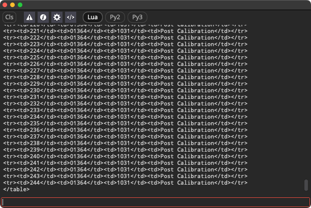

# Lightfielder | Scripts

## 20 Show Console

Toggle the visibility of the Resolve Console window. This allows you to troubleshoot Lightfielder script errors if the Python scripts stop working as expected in future Resolve Studio versions.

### Script Usage:

1. Open Resolve. Select the menu item: "Workspace > Scripts > Lightfielder > 20 Show Console" • OR Select Tool Bar then click "20" button.

2. The Resolve Console appears.
