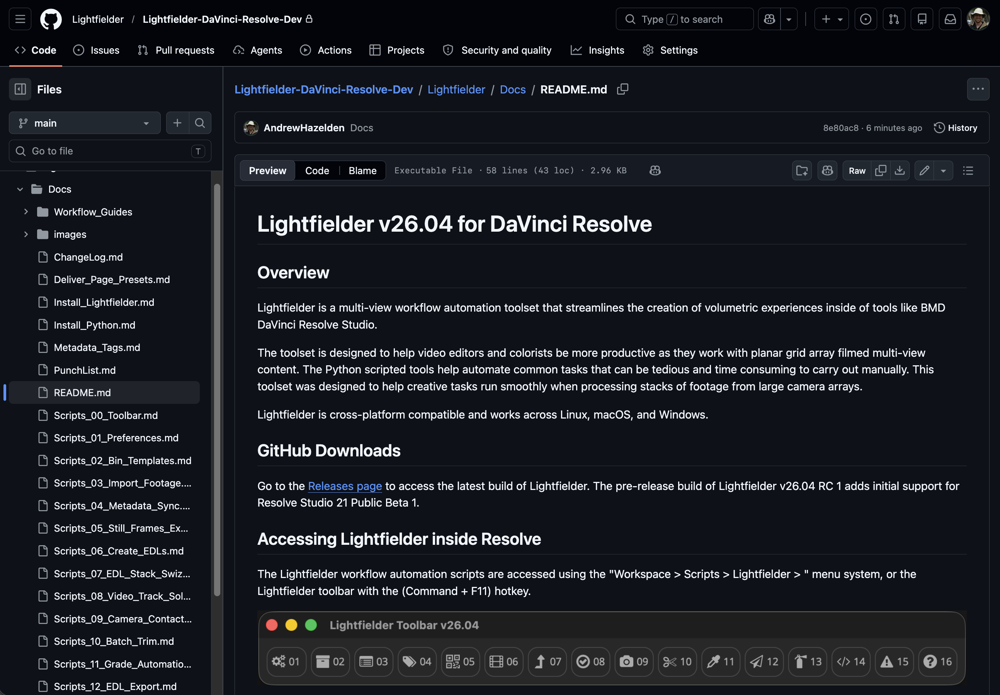

# Lightfielder | Scripts

## 21 Documentation

The latest updated version of the Lightfielder Documentation can be accesed on the [Lightfielder project's GitHub page](https://github.com/AndrewHazelden/Lightfielder-DaVinci-Resolve/tree/main/Lightfielder/Docs).

### Script Usage:

1. Open Resolve. Select the menu item: "Workspace > Scripts > Lightfielder > 21 Documentation" • OR Select Tool Bar then click "21" button.
