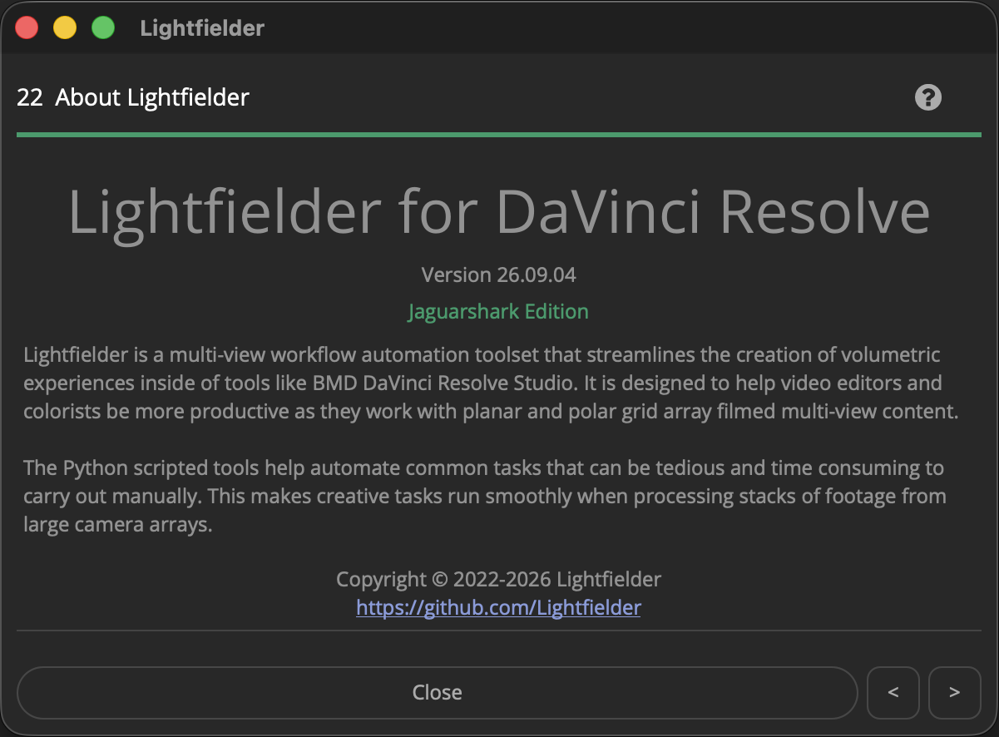

# Lightfielder | Scripts

## 22 About Lightfielder

Shows an about dialog with details about the toolset:

Lightfielder is a multi-view workflow automation toolset that streamlines the creation of volumetric experiences inside of tools like BMD DaVinci Resolve Studio. It is designed to help video editors and colorists be more productive as they work with planar and polar grid array filmed multi-view content.

The Python scripted tools help automate common tasks that can be tedious and time consuming to carry out manually. This makes creative tasks run smoothly when processing stacks of footage from large camera arrays.

### Script Usage:

1. Open Resolve. Select the menu item: "Workspace > Scripts > Lightfielder > 22 About Lightfielder" • OR Select Tool Bar then click "22" button.
