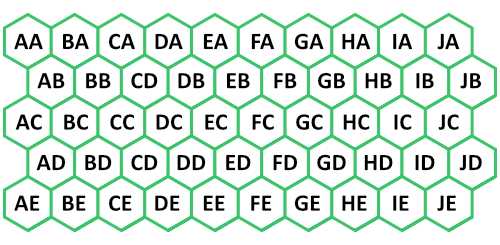

# Lightfielder | Shotlog Format

The shotlog data used by Lightfielder is exported in a CSV (Comma Separated Value) format.

A typical "shotlog.csv" entry looks like this:

```
clip,shot,date,description
50,01325,0309,calibration
```

The column 1 "clip" heading matches up against the R3D file's clip number found in the second number grouping.

The column 2 "shot" heading is used to track each of the different capture sessions on the day. This Shot ID value is later used to create "03-footage/" bin sub-folder names and timeline names that are written as "ID_1040".

The column 3 "date" heading matches the 4 digit date code from the R3D filename.

The column 4 "Description" heading holds values like "calibration", "post-calibration", "hdri", or a listing of what was filmed.

## Camera Date

Make sure to verify the date and time is correct on the RED cameras when filming as you can have a situation occur where a late night filming session can have the date code roll over.

When this happens part way through a shoot, the .r3d filename date label won't match what you wrote in the shotlog. This date mismatch will cause the footage to be skipped on import in Resolve.

You will need to solve this by updating the date field in the shotlog.csv file starting at the CSV entry where the camera naming date code drifted in the r3d files, compared to the real-world filming date.

## Camera Array Geometry

### Red R3D Clip Naming

Here is a guide on the [R3D Clip filename structure](http://docs.red.com/955-0047/MediaOperationGuide/Content/5_Eject_And_Format_Media/Clip_Naming_Convention.htm).

### Planar Grid (A1-E5) Layout

The A1-E5 grid approach is useful for 50-view camera arrays that tightly pack the R3D camera bodies close together:



In the original Lightfielder camera array back in 2023, footage was named like:

RED filename "`J001_E050_0309BX_001.R3D`"  (File level) 

- J = Camera View Row (1-10)  
- E = Camera View Column (1-5)  
- 050 = Clip Number 50  
- 0309 = Day/Month  

R3D sub-clip sequence naming example:

```
J001_E050_0309BX.RDC/J001_E050_0309BX_[001-008].R3D
```

R3D sub-clip filenames on disk:

```
J001_E050_0309BX_001.R3D
J001_E050_0309BX_002.R3D
J001_E050_0309BX_003.R3D
J001_E050_0309BX_004.R3D
J001_E050_0309BX_005.R3D
J001_E050_0309BX_006.R3D
J001_E050_0309BX_007.R3D
J001_E050_0309BX_008.R3D
```

#### A1-E5 EDL Formatting Example

This snippet from an EDL file shows an entry for a single RED .r3d based video clip that is loaded into video track 1:

```
001  AA   	V 	C    	05:48:54:05 05:50:02:19 01:00:00:00 01:01:08:14  
\* FROM CLIP NAME: A001\_A055\_1116A5\_001.R3D
```

#### A1-E5 Camera Placement

The chart below was created with top-left aligned column-major ordering.  
The vertical column labels go from A-J (X-Axis \#1-10) . The horizontal row labels go from A-E (Y-Axis \#1-5).

| AA | BA | CA | DA | EA | FA | GA | HA | IA | JA |
| :---- | :---- | :---- | :---- | :---- | :---- | :---- | :---- | :---- | :---- |
| AB | BB | CB | DB | EB | FB | GB | HB | IB | JB |
| AC | BC | CC | DC | EC | FC | GC | HC | IC | JC |
| AD | BD | CD | DD | ED | FD | GD | HD | ID | JD |
| AE | BE | CE | DE | EE | FE | GE | HE | IE | JE |

#### A1-E5 Video Track to View Name Mapping:

Track V1 \= AA  
Track V2 \= AB  
Track V3 \= AC  
Track V4 \= AD  
Track V5 \= AE  
Track V6 \= BA  
Track V7 \= BB  
Track V8 \= BC  
Track V9 \= BD  
Track V10 \= BE  
Track V11 \= CA  
Track V12 \= CB  
Track V13 \= CC  
Track V14 \= CD  
Track V15 \= CE  
Track V16 \= DA  
Track V17 \= DB  
Track V18 \= DC  
Track V19 \= DD  
Track V20 \= DE  
Track V21 \= EA  
Track V22 \= EB  
Track V23 \= EC  
Track V24 \= ED  
Track V25 \= EE  
Track V26 \= FA  
Track V27 \= FB  
Track V28 \= FC  
Track V29 \= FD  
Track V30 \= FE  
Track V31 \= GA  
Track V32 \= GB  
Track V33 \= GC  
Track V34 \= GD  
Track V35 \= GE  
Track V36 \= HA  
Track V37 \= HB  
Track V38 \= HC  
Track V39 \= HD  
Track V40 \= HE  
Track V41 \= IA  
Track V42 \= IB  
Track V43 \= IC  
Track V44 \= ID  
Track V45 \= IE  
Track V46 \= JA  
Track V47 \= JB  
Track V48 \= JC  
Track V49 \= JD  
Track V50 \= JE

### Wedge 3M (A1-E5) Layout

A wedge layout camera rig was used for a period of time.

RED filename "`J001_E050_0309BX_001.R3D`" (File level) 

- J = Camera View Row (1-10)  
- E = Camera View Column (1-5)  
- 050 = Clip Number 50  
- 0309 = Day/Month  

### Polar (A110-Z997) Layout

In autumn 2024 the Lightfielder Array changed the naming structure to a new system that is dependent on a Technisync JSON document named "activeTechnisyncConfig.json". This file is typically saved to the Resolve project's "08_documents" folder.

[R3D Clip Naming](http://docs.red.com/955-0047/MediaOperationGuide/Content/5_Eject_And_Format_Media/Clip_Naming_Convention.htm)

RED filename "<span style="color: rgb(234, 51, 34)">A</span><span style="color: rgb(83, 175, 235)">335</span>\_<span style="color: rgb(77, 172, 87)">C</span><span style="color: rgb(241, 193, 150)">003</span>\_<span style="color: rgb(95, 131, 185)">0502</span><span style="color: rgb(127, 148, 80)">GX</span>.R3D" (File level) 

(The filename above reads: Section A, 3rd Row Down, 3rd position from left, 5th position vertically)

We use the first letter as our <span style="color: rgb(234, 51, 34)">Rig "Section" A-P</span>, as we have 16 Sections as a stand in for 1-16.

We use the next <span style="color: rgb(83, 175, 235)">3 numbers</span>, after the Rig Section entry, to identify the following:

- 1st Digit = Row (Numerical A=1 to P=16)
- 2nd Digit = Horizontal Position in Section (1-7)
- 3rd Digit = Vertical Position in Row (Vertical 1-7)

The <span style="color: rgb(77, 172, 87)">Second letter</span> is our <span style="color: rgb(77, 172, 87)">"Rig Row"</span> where <span style="color: rgb(77, 172, 87)">A-E</span> stands in for 1-5, this is RED’s "magazine/clip number" signifier We use the next <span style="color: rgb(241, 193, 150)">3 Numbers</span> to indicate the shot number which represents the current times the record button is pressed this session. The next <span style="color: rgb(95, 131, 185)">4 numbers</span> are dictated by RED indicating the Date MMDD. The remaining <span style="color: rgb(127, 148, 80)">2 letters</span> are dictated by RED, indicating a two-character check-sum.

