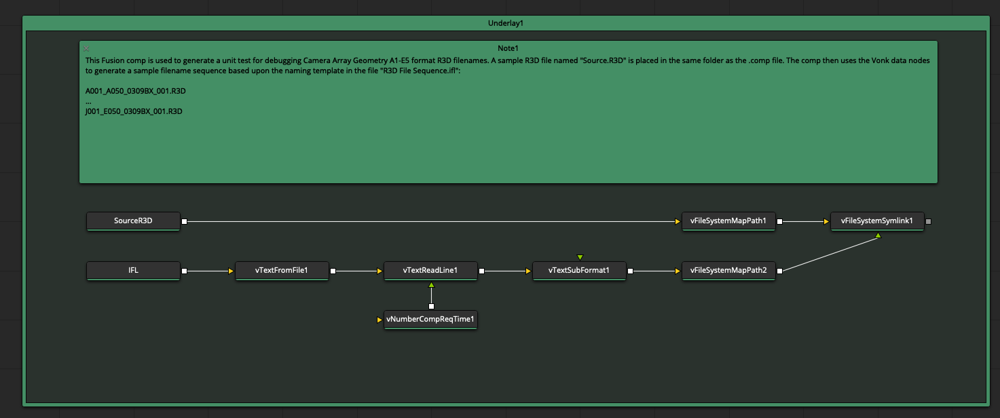
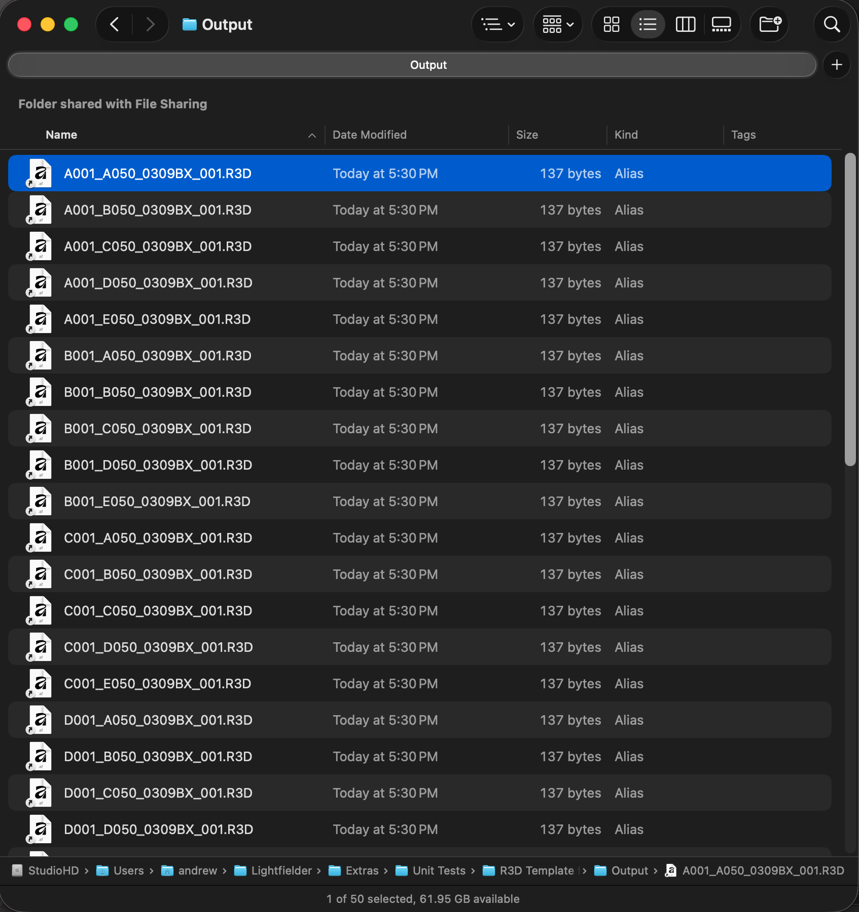

# Lightfielder | Unit Tests

A collection of new "unit tests" are being developed for the Lightfielder for DaVinci Resolve repo. They allow the Lightfielder script functionality to be validate with synthetic camera array data. This avoids the need to interact with NDA covered media assets when developing and debugging the core scripts.

These assets are located in the GitHub repo at:  
`Lightfielder/Extras/Unit Tests/`

## What is a Symlink?

A [Symlink](https://en.wikipedia.org/wiki/Symbolic_link) (which is also known as a "Symbolic Link") is a UNIX centric idea of a shortcut like file reference that points to the original file. This approach allows you to have synthetic R3D file names generated for each camera view, without the disk burden of storing hundreds of GBs of data. A Symlink is usually only a few KBs in size.

You can manually delete a symlink file if you would like to remove it. The original file will remain on disk.

## R3D Template for 50 Camera Array A1-E5

The unit test folder "R3D Template for 50 Camera Array A1-E5" includes a Fusion .comp file named "`Create a Symlinked R3D Sequence.comp`".



This Fusion comp is used to generate a unit test for debugging 50 camera array geometry A1-E5 format R3D filenames. A sample R3D file named "`Source.R3D`" is placed in the same folder as the .comp file. The comp then uses the [Vonk data nodes](https://kartaverse.github.io/VonkUltra/) to generate a sample filename sequence based upon the naming template in the file "`R3D File Sequence.ifl`":

```
A001_A050_0309BX_001.R3D
...
J001_E050_0309BX_001.R3D
```

To use this unit test, you need to turn off the comp's timeline "looped" playback mode. View the "`vFileSystemSymlink1`" node in the Fusion viewer window, and press the timeline play button. This will cause the node's output to be rendered to disk.

A new "Output" folder is created in the same folder as the .comp file. The Output folder will have a sequence of 50 RED files created as Symlinks that point to the "`Source.R3D`" sample file you provide.




The "`Lightfielder/Extras/Unit Tests/R3D Template for 50 Camera Array A1-E5/Shotlog.csv`" file is used to do the Lightfielder Toolbar validation steps in Resolve Studio:

```
clip,shot,date,description
050,001,0309,calibration
```

##  R3D Template for 50 Camera Array A110-J570

This Fusion comp is used to generate a unit test for debugging 50 camera array geometry A110-J570 format R3D filenames.

A sample R3D file named "`Source.R3D`" is placed in the same folder as the .comp file. The comp then uses the Vonk data nodes to generate a sample filename sequence based upon the naming template in the file "`R3D File Sequence.ifl`":

```
A110_A050_0309BX_001.R3D
...
J570_E050_0309BX_001.R3D
```

The "`Lightfielder/Extras/Unit Tests/R3D Template for 50 Camera Array A110-J570/Shotlog.csv`" file is used to do the Lightfielder Toolbar validation steps in Resolve Studio:

```
clip,shot,date,description
050,001,0309,calibration
051,002,0309,content
052,003,0309,hdri
053,004,0309,content
```

##  R3D Template for 55 Camera Array A110-Z579

This Fusion comp is used to generate a unit test for debugging 55 camera array geometry A110-Z579 format R3D filenames.

A sample R3D file named "`Source.R3D`" is placed in the same folder as the .comp file. The comp then uses the Vonk data nodes to generate a sample filename sequence based upon the naming template in the file "`R3D File Sequence.ifl`":

```
A110_A050_0619BX_001.R3D
...
Z579_E050_0619BX_001.R3D
```

The "`Lightfielder/Extras/Unit Tests/Unit Tests/R3D Template for 55 Camera Array A110-Z579/Shotlog.csv`" file is used to do the Lightfielder Toolbar validation steps in Resolve Studio:

```
clip,shot,date,description
050,001,0619,calibration
```
