# Lightfielder Live Grade Video Flowchart

Prepared by: Andrew Hazelden <andrew@andrewhazelden.com>  
Date Created: 2026-04-02  

## System Overview

This document describes the video flow for a 50 camera array system that uses SDI output at 6K video resolution from RED Digital Cinema camera bodies, ultimately producing 3DGS (Gaussian Splat) trained 3D model assets.

## Flowchart

*Figure 1: Complete video flow from camera array to 3D model output*

```mermaid
flowchart TB
    %% Styling
    classDef camera fill:#e74c3c,stroke:#c0392b,color:#fff
    classDef router fill:#3498db,stroke:#2980b9,color:#fff
    classDef switcher fill:#2980b9,stroke:#1f6391,color:#fff
    classDef capture fill:#8e44ad,stroke:#7d3c98,color:#fff
    classDef grading fill:#f39c12,stroke:#d68910,color:#fff
    classDef docker fill:#27ae60,stroke:#1e8449,color:#fff
    classDef colmap fill:#16a085,stroke:#148f77,color:#fff
    classDef nvidia fill:#2ecc71,stroke:#27ae60,color:#fff
    classDef output fill:#1abc9c,stroke:#17a589,color:#fff

    %% A. Camera Array
    subgraph A ["A. CAMERA ARRAY & SOURCE"]
        A1["50x RED Digital Cinema"]
        A2["High Resolution | SDI Output per Camera"]
    end

    %% B. Routing
    subgraph B ["B. SIGNAL ROUTING & SWITCHING"]
        B1["Blackmagic Smart Videohub 72x72"]
        B2["40 SDI Feeds → Blackmagic ATEM Switcher"]
    end

    %% C. Capture
    subgraph C ["C. CAPTURE & HOST SYSTEM"]
        C1["SDI Program Output from ATEM"]
        C2["Blackmagic 8K SDI Capture Card"]
        C3["Lenovo Workstation (Resolve Studio Host)"]
    end

    %% D. Grading
    subgraph D ["D. COLOR GRADING (LIVE GRADE)"]
        D1["DaVinci Resolve Studio Live Grade Session"]
        D2["DRX/LUT File Creation"]
        D3["Multi-View Color Grading Applied"]
    end

    %% E. 3D Processing
    subgraph E ["E. 3D MODEL ASSET GENERATION"]
        E1["Docker Container"]
        E2["COLMAP (Structure-from-Motion)"]
        E3["NVIDIA 3DGRUT (3D Gaussian Raytracing)"]
        E4["3DGS Gaussian Splat 3D Model Asset"]
    end

    %% Connections
    A1 --> A2
    A2 -->|"50x SDI Feeds"| B1
    B1 -->|"40x SDI Feeds"| B2
    B2 --> C1
    C1 --> C2
    C2 --> C3
    C3 --> D1
    D1 --> D2
    D2 --> D3
    D3 -->|"Graded Media"| E1
    E1 --> E2
    E2 --> E3
    E3 --> E4

    %% Apply styles
    class A1,A2 camera
    class B1,B2 router
    class C1,C2,C3 capture
    class D1,D2,D3 grading
    class E1 docker
    class E2 colmap
    class E3 nvidia
    class E4 output
```

---

## Detailed Video Flow Summary

### A. Camera Array & Source

- **50x RED Digital Cinema cameras**, each set to output high resolution video
- Each camera utilizes a dedicated **SDI output connection** to transmit its video signal

### B. Signal Routing and Switching

- All **50x SDI video feeds** are physically connected to the inputs of a **Blackmagic Smart Videohub 72x72** router
- **40x SDI outputs** are patched from the Videohub to the **40 SDI inputs of a Blackmagic ATEM switcher** (e.g., ATEM Constellation 8K)

### C. Capture and Host System

- A **single SDI video output** (Program output) is routed from the ATEM switcher
- This signal is captured by a **Blackmagic SDI video capture card (8K resolution capable)** installed within a **Lenovo Workstation host computer**

### D. Color Grading and Multi-View Application

- The workstation runs a **DaVinci Resolve Studio "Live Grade" session** which monitors the incoming signal
- The Live Grade process creates a **DRX/LUT file**
- This DRX/LUT is applied to enable **multi-view color grading** on the entire array's footage. This is possible using either the DRX file with the DaVinci Resolve Open FX Renderer plugin in any OpenFX compatible host, or a standard LUT based color grade.

### E. 3D Model Asset Generation

- The **multi-view media** is pulled as a set of timecode synced stills at a predefined interval from the camera array. This footage is graded, and then routed for processing into a **Docker container**. This container can be run on an existing Rocky Linux 10 based grading suite (with a NVIDIA GPU), or pushed as a background task to a cloud hosted GPU compute instance on a platform like Amazon AWS, Google GCP cloud, etc.
- Inside the container:
  - A task scheduler/render queue program
  - **COLMAP**: Runs Structure-from-Motion (SfM) to solve for camera positions and point clouds
  - **NVIDIA 3DGRUT Library**: Executes 3D Gaussian Raytracing for training the final model
- The workflow concludes with the generation of a **3DGS (Gaussian Splat) trained 3D model asset**

---

## System Specifications

| Component | Specification |
|-----------|---------------|
| Camera | RED Digital Cinemas |
| Camera Count | 50 cameras |
| Native Video Resolution | 6K |
| Router | Blackmagic Smart Videohub 72x72 |
| Switcher | Blackmagic ATEM (40 SDI inputs) |
| Capture Card | Blackmagic SDI (8K capable) |
| Workstation | Lenovo Workstation |
| Software | DaVinci Resolve Studio (Live Grade) |
| 3D Processing | Docker + COLMAP + NVIDIA 3DGRUT |
| Output | 3DGS (Gaussian Splat) 3D Model |

---
