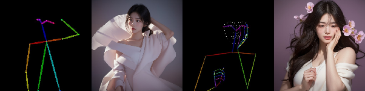
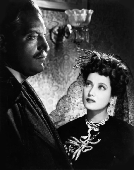
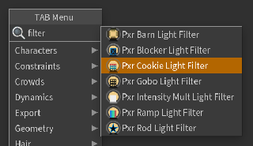

# **Volumetric Color Decision Lists**

Created: 2026-06-05  
Last Updated: 2026-08-03 11.01 PM  
Written By: Andrew Hazelden ([andrew@andrewhazelden.com](mailto:andrew@andrewhazelden.com))

A Volumetric Color Decision List (V-CDL) is the idea behind a new scene-aware 3D grading concept that goes beyond the 2D/screen space for virtual production, XR, and AI/VFX integration work in media production.

## Overview

The current film and TV production workflows for color grading operate on the "screen space" image plane of the video format. This is the coordinate system that OpenFX plugin based effects and color grading tools are applied in. This would include grain management, vignetting, power windows, film halation, defocus operations, and selective color grading with masks.

With the advent of virtual production, HMD based immersive media, and Gen AI content creation, the existing color grading approaches could reasonably be extended further beyond the current 2D / stereo 3D domains offered in tools like DaVinci Resolve, SGO Mistika, Baselight, Flame, and Assimilate Scratch.

Color grading currently uses terms like a CDL ([Color Decision List](https://en.wikipedia.org/wiki/ASC_CDL)), 3D Color LUT ([Look Up Table](https://en.wikipedia.org/wiki/3D_lookup_table)), or a DRX Grade (Resolve Grade). Going forward, we need to have volumetric 3D scenegraph aware versions of these same color grading concepts. A placeholder working title for this idea could be termed a V-CDL "Volumetric Color Decision List".

An additional concept for immersive narrative storytelling would be to extend the ASC FDL ([Framing Decision List](https://media.githubusercontent.com/media/ascmitc/fdl/refs/heads/main/docs/ASCFDL_UserGuide_v2.0.pdf)) to support limited agency storytelling needs. Often a realtime experience needs to limit the ability of a character to look in specific directions in a scene, or to control where the observer can travel with a NavMesh ([navigation mesh](https://en.wikipedia.org/wiki/Navigation_mesh)). This streamlines locomotion and teleportation “hops” for a player by helping them automatically stay on pathways and trails. Better attention control helps when it is important to convey a key plot point in a story. 

Limited agency capabilities also allow for partial capture of real-world scenes, and the use of “non-water tight” volcap meshes in immersive experiences. This is something that is needed when physical constraints to camera placement on location cannot support anything more than hollow partial-shell-like captures of some assets. 

Agency control / camera framing control restrictions can also help to enforce minimum personal space distances between several observers in a shared space to improve viewer comfort, and maintain the feeling of a safe-space boundary. Platforms like the Meta's Horizon Worlds “metaverse” had issues on launch where the player’s in-scene avatar character would experience frequent personal space distance violations that made participants feel very uncomfortable.

## What is XR color grading trying to accomplish?

The traditional skills of a DOP/cinematographer, and a colorist, are very essential in new media projects where color consistency and lighting needs to be sculpted shot-by-shot / scene by scene with a high degree of control to evoke a specific mood and style.

There is an ever growing number of volumetric production techniques that allow for greater control and agency over the placement of the observer/camera in the scene, with the "player" having a free range of motion inside a larger world. This provides additional flexibility on how lighting is controlled in a purely digital/virtual realm.

*Note: Existing color correction techniques such as multi-channel alpha masking with Cryptomatte can be expanded to work with image based rendering and video/photogrammetry, too. This unlocks per-object or per-material masking access that allows for temporarily stable ML segmentation of texture maps from volumetric video captures, and environment/asset 3D scans. This achieves a higher degree of selective color adjustment or PBR re-lighting (diffuse/specular/reflectivity material changes) in immersive content that would not be cost-effective with manual rotoscope based masking of the original multi-view camera footage.*

Examples of volumetric content production efforts that require precise control over lighting, shadows, and color in each scene include: 

* Virtual production LED stage focused VAD (Virtual Art Departments) work  
* Narrative driven immersive XR experiences  
* Visual effects artists working on lighting and lookdev that combine hybrid live action media with CGI and synthetic Gen AI assets

Research on topics like “neural inverse rendering” will further expand the creative possibilities of volumetric relighting and color grading in immersive XR and realtime content creation.

Volumetric grading approaches effectively unlock the full potential of renderless compositing (a concept developed ~17 years ago by a Kartaverse project collaborator named Aurore de Blois) where realtime-rendered productions have composting-artist level control over the contribution of all light sources, surface shading passes in the scene, and optical effects without the need to use offline post-production tools. Previously, 3D artists needed to generate EXR image sequence renders from their 3D software before it was possible to use multi-pass compositing approaches.

With the expansion of dimensions from 2D to volumetric 3D there is a natural increase of complexity. This makes for more objects that need to be interacted with when precisely adjusting lighting and color. Regular expression ([RegEx](https://en.wikipedia.org/wiki/Regular_expression)) style pattern matching and wildcard symbols can help to tame object selections. This approach allows partial matches of names such as “light\*” to match several objects that have similar names such as “light1” to “light1001”.   
Batch parameter changing with the help of a feature called a “selection set” can also reduce the time needed for grading adjustments when working on multiple shots in the same setting. Additionally the idea of “light linking” allows only some objects to receive illumination from a light source.

# Gen AI and Lighting Control

When visual effects artists work with Generative AI tools that use [stable diffusion](https://en.wikipedia.org/wiki/Stable_Diffusion), there are controls in packages like [ComfyUI](https://en.wikipedia.org/wiki/ComfyUI) for consistent character output, but not tools for consistent lighting control that would work in the way that a DOP or cinematographer would be used to.

For character creation in Gen AI, this control layer is achieved using [LoRAs](https://docs.comfy.org/tutorials/basic/lora) (pre-trained models for a specific performer) and [ControlNet](https://docs.comfy.org/tutorials/controlnet/controlnet) which supports loading a depthmap of the scene, and modifying a skeleton system that allows a character to be posed in a specific way using a character rig ([OpenPose](https://docs.comfy.org/tutorials/controlnet/pose-controlnet-2-pass)).

  
*(OpenPose sample image from ComfyUI Documentation)*

There is no existing system that provides a high degree of predictable direct control over individual light sources and their placement in a Gen AI scene. Having locator based light position controls would help to match onset lighting expectations. This level of interaction is possible in CGI/VFX based lighting and lookdev tools for sculpting the influence of light sources, light decay, or for applying [DMX](https://www.openlighting.org/) like 4D animated lighting values.

For lighting control in a Gen AI scene you currently have the option of [image-to-image](https://docs.comfy.org/tutorials/basic/image-to-image) (using a pre-made reference image), or prompt (text based) input where you use a large paragraph of text to describe the lighting contribution to the scene.

At a technical level, it would be fully possible to extend the concepts used by ControlNet for character level control in stable diffusion. This allows for art direction of Gen AI lighting and shadows. A mechanism like a “Volumetric Color Decision List” allows a very high degree of control (at a per-light level) that would go far beyond what is possible with purely a descriptive Gen AI text prompt.

## Coordinate Systems

In volumetric media production, lighting control and color grading operations need to occur in a consistent way across multiple coordinate systems for each scene. The different coordinate systems are used based upon which transformation space allows the most direct control when assigning specific effects, or in sculpting the results of lighting falloff and other stylizations.

### Screen Space/Lens Space

The base coordinate system for a volumetric color decision list would still be the "Screen Space" which is the final frame buffer the observer uses to view the content. This coordinate system is the domain where film grain synthesis operations would be applied, lens flares, gleams and glows, simulated lens textures like dirt, as well as film halation, and Gen-AI based style transfer effects.

Depth of field effects such as Bokeh simulation are typically computed in screen space. This defocus process is driven using a measure of distance from the camera film plane to objects in the scene, as well as the lens characteristics such as aperture (f-stop), focal length, and lens design.

Motion blur simulation uses the frame rate, and shutter angle to help compute the result. Details like the amount of motion sub-steps for each animated mesh will define if circular motion like helicopter rotors spinning in an arc have the correct look.

### Performer Space

Color grading operations like "eye light" would be applied in a coordinate space that is linked to the location of the volumetric captured performer in the scene. This allows for the lead or background characters to have selective lighting applied that remains linked to them as they move.

This level of control helps to support customized lighting effects and light filters in a realtime XR narrative storytelling setting, regardless of the character's current position in the scene. 

By linking/parenting lights to a performer it allows for mild agency for the character in the set, in relation to the observer’s position, without having the grading stylization break down.

The placement of [Crepuscular light](https://en.wikipedia.org/wiki/Crepuscular_rays) or shafts of light in a scene could also be linked to the performer space. This could be achieved with an "aim constraint” that dynamically aligns a light emitter to so it is centered on a light-blocker like a tree or a skylight window opening and the exact location where a specific performer stands. This is a handy technique if the shafts of light are required by the script to show up in a specific location such as directly behind a performer in a scene.

Eye light can be seen in films all the way back to "[The Lodger (1944)](https://en.wikipedia.org/wiki/The_Lodger_\(1944_film\))" movie.

  
*The Lodger (1944) Film*

Elements like gaze detection would also occur in performer space where the characters in a narrative XR experience would be able to pay attention to the observer and each other when making eye contact, if desired. 

This technique makes conversations between characters feel more natural and allows the observer (game player) to be an integral part of the story where their physical presence is acknowledged aka "breaking the fourth wall". This helps avoid the eerie feeling that the pre-recorded performances have the characters looking "right through the observer" like they are not physically there.

When the game player has the ability to move freely in the scene, the story narrative can’t ensure that the lead characters in the story and NPC (non playing background characters) are always in the exact same location, or have the same eye “sight lines”, each time an XR experience is played if collision avoidance is active in the crowd animation system.

### Observer Space

For interactive experiences like games and immersive XR content, there is a need to be able to attach lighting falloff controls so they are linked to the position and rotation of the observer (character controller) in the scene.

For example, if the observer was navigating inside a tight space like an underground cave or tunnel, it might be desirable to art direct the feeling of the tight confined space. This sense of presence and claustrophobia could be heightened by applying an exponential “non-physical” lighting decay effect on the torch/light source. This would be useful when a player navigates through a tighter space like an obstruction in their path before their journey leads them into a larger space.

Volume fog effects (fog strength and visibility distances) could also be linked to the observer space. This would allow narrative pieces to have the ability to add a "[fog of war](https://en.wikipedia.org/wiki/Fog_of_war)" constraint to limit the visibility or awareness of specific set elements in the environment, until key story points are met or a checkpoint has been reached.

### Object Space / Local Space

If objects have illumination sources built into the 3D asset it makes sense to be able to control the color and intensity of the integrated lights. This would typically be relevant in low-light dusk/night/dawn scenes that feature volcap characters travelling in vehicles (like cars, motorbikes, airplanes, and boats), and for interior and exterior lighting designs on structures like homes and offices.

### World Space

There is a strong need to have a consistent and unified lighting style when assembling volumetric experiences.

A world space coordinate system is typically the level used when combining large scale 3D environment scans, with volumetric video performance capture clips of characters, as well as 100% synthetic CGI assets such as PBR textured polygon models, and Gen AI assets.

When mixing elements made or captured in isolation, a lighting and style consistency requirement is something that is often impossible to achieve fully "in camera" for all of the source content. This creates a situation where further color matching, texture cleanup work, or geometry remodelling is required to be able to use these assets together.

The world space coordinate space is where traditional onset lighting concepts such as DMX lighting control allow for time varying illumination of each light source. A real-world DMX console is able to record and save these lighting values which can be used in post-production to illuminate CGI assets so they match the live action captured lighting choices made onset for events like music performances.

For location based environment creation efforts, LiDAR (laser scanning) and high-resolution IBL panoramic background capture will always have some element of real world “time of day” lighting and shadows baked into the RAW captured data. This is where a de-lighting workflow can be attractive in post-production to allow the data to be used in other lighting setups.

The filming of volcap (volumetric performance capture) sequences typically happens in a large studio space with a flat lighting setup that has a white light color and soft shadows. Having access to HDR (high dynamic range) image data and PBR relighting capacity for the volcap content will provide a greater range of freedom for the storyteller. 

Additionally, considerations such as day-for-night color grading based changes of illumination in a scene also have to be supported since multi-view volumetric capture setups do not work well in low light. A camera sensor returns high levels of sensor noise in non-ideal low light environments which makes some “in-camera” concepts not practical.

Film and TV based production renderers like Pixar's [RenderMan](https://renderman.pixar.com/) allow light sources to have their falloff sculpted and art-directed using a feature called "[light filters](https://rmanwiki-27.pixar.com/space/REN27/542228334/Light+Filters)". This lighting technique allows for the simulation of barn doors, light blockers, cookies, gobos, the ramping of lighting intensity, and other light decay approaches to be applied interactively. With the addition of CPU/GPU based "XPU" rendering it is now possible to see the results of these lighting adjustments with very little delay.

  

# **Condensed Version of Volumetric CDL Ideas**

Current color grading workflows operate on the 2D image plane (screen space). This is the coordinate system used by OpenFX plugins, vignettes, power windows, grain, halation, and selective grading. With the rise of virtual production, HMD-based immersive media, and generative AI, color grading must extend beyond 2D/stereo 3D domains (DaVinci Resolve, Mistika, Baselight, Flame, Scratch).

We propose a Volumetric Color Decision List (V-CDL). A scenegraph aware, volumetric analog to CDLs, LUTs, or DRX grades.

Cinematographers and colorists remain essential for shot‑by‑shot color and lighting control in new media. Volumetric production techniques (free‑viewpoint, flexible camera placement) demand advanced lighting control. Examples: virtual art department work on LED stages, narrative immersive XR, VFX lighting and lookdev that needs to combine live action with synthetic/gen‑AI assets.

Gen AI tools like Stable Diffusion and ComfyUI offer character consistency via image-to-image, LoRAs and ControlNet (depthmaps, poses), but lack direct lighting control comparable to on‑set or CGI workflows. Current lighting options are primarily image‑to‑image or descriptive text prompts. A V‑CDL could extend ControlNet principles to enable per‑light art direction, which would provide precision far beyond prompt‑based control.

## Coordinate Systems

Volumetric color decisions must operate consistently across several coordinate systems:

### Screen Space / Lens Space

Final frame buffer. Used for film grain, halation, style transfer, depth of field (bokeh as distance from film plane), and motion blur (frame rate, shutter angle, motion sub‑steps).

### Performer Space

Lighting falloff tied to the lead or background character positions, as well as gaze detection and eye contact.

### Observer Space

For interactive experiences (games, immersive). Lighting falloff tied to observer position (e.g., non‑physical decay for a torch in a confined cave).

### Object Space / Local Space

Lighting control for light sources integrated into physical assets like vehicles or structures.

### World Space

For unified lighting when assembling large‑scale environments (3D scans, volumetric video, CGI assets, gen AI). Addresses lighting mismatches not solvable “in camera”. 

This includes DMX‑recorded time‑varying illumination for matching live action, de‑lighting workflows for LiDAR/panoramic IBL captures, HDR/PBR relighting of volumetric performance capture, day‑for‑night adjustments, and production renderer features (e.g., RenderMan light filters: barn doors, gobos, intensity ramping, light decay).  
