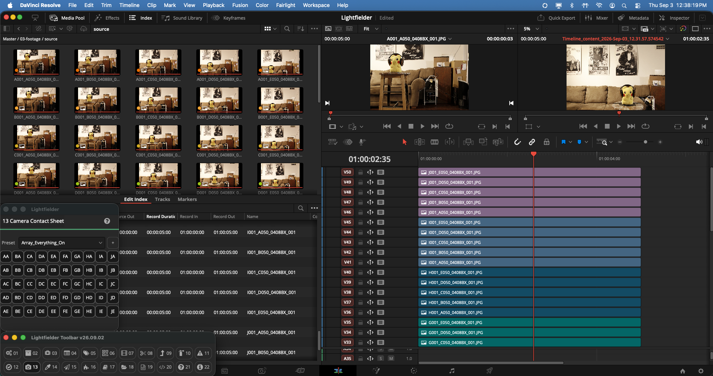
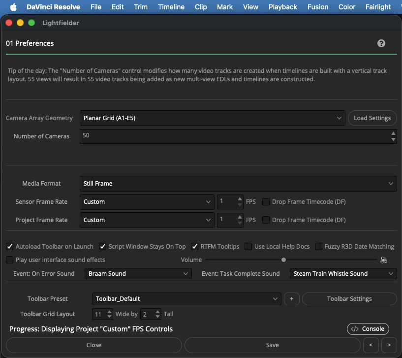
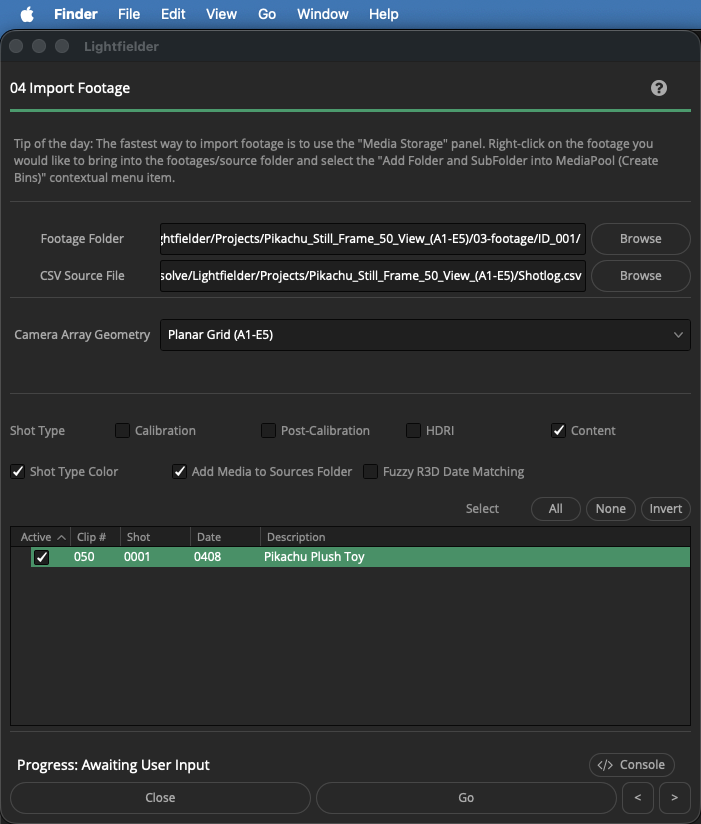
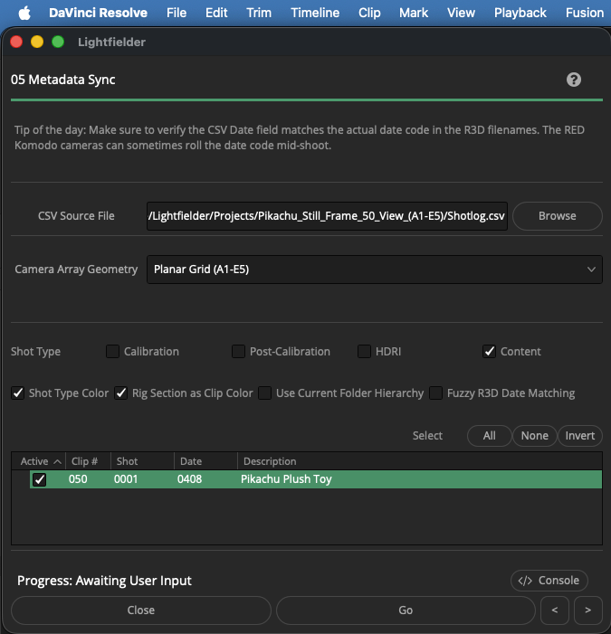
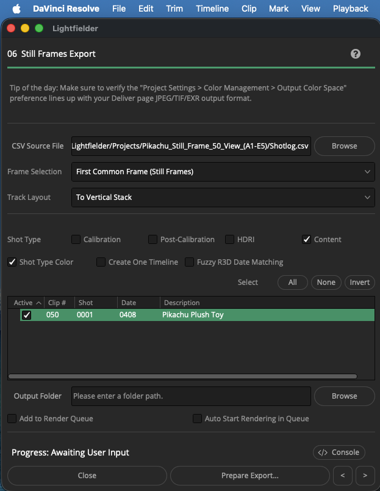

# Pikachu Example

> Media Captured: April 8, 2017

Example Media By: Tobias Chen `<me@tobiaschen.com>` of VCS (Volumetric Camera Systems)  
Media License: Creative Commons CC0  

## Overview

This is a 50 view (10x5 planar grid array layout) lightfield sample dataset of a Pokemon Pikachu plush toy.

The footage was captured on April 8, 2017 using a linear slide rail and a Canon REBEL DSLR. The scene was filmed in Tobias' old apartment in Toronto, Canada on one of the last days of university at UofT.

This project was the start of Andrew Hazelden and Tobias Chen's VCS and Lightfielder experiments into mult-view capture and reconstruction workflows. Previously the R&D focus was on fulldome omni-stereo planetarium rendering, 360VR video stitching, and immersive live-streaming.

## Media Usage and Image Details

The example footage matches the Lightfielder for DaVinci Resolve "Camera Array Geometry" A1-E5 filename conventions.

The footage can be imported into Resolve with the "Media Format" Still Frame option in the Lightfielder Preferences window. Set the Sensor and Project Frame Rate to "Custom" then use the 1 FPS option.

The Resolve Project Settings for Resolution and the Timeline Resolution should be set to "5184x3456 px".

Image Specifications:

- Per-Image Filesize: 6MB  
- Image Resolution:  5184x3456 px  
- Camera: Canon EOS REBEL T5i  
- Lens: Canon EF-S18-135mm lens f/3.5-5.6 IS STM  
- Aperture: f/5.375  
- Exposure: manual exposure at 1/4 second.  
- ISO: 400  

## Lightfielder Screenshots

## Lightfield Video Demo

<YouTube id="lWMF5g1MR_o" title="Lightfield Planar Grid Array Demo in Unreal" />

This Unreal lightfield based 6DoF navigation screenvideo recording was created two years later using the [Realception for Nuke/Unreal plugin](https://www.iis.fraunhofer.de/en/ff/amm/content-production/realception.html).
