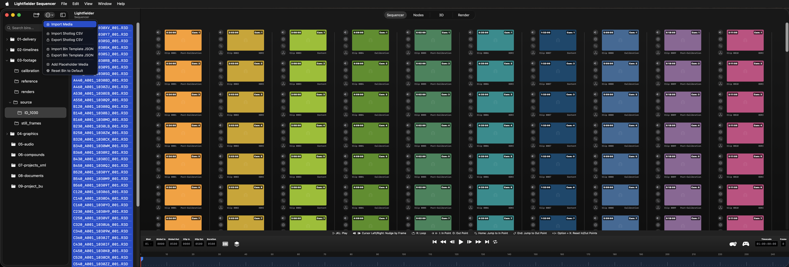

# Lightfielder Operators

Created by: [Andrew Hazelden](mailto:andrew@andrewhazelden.com)

## Overview

Ops is a [rust language](https://rust-lang.org/) based agentic interface to control and visualize distributed render tasks running on HPC systems. It is cross-platform compatible and works across Linux, Windows, and macOS.

You can also use a light-weight Swift UI build of the Lightfielder Ops user interface. This version is optimized for the Apple Silicon (ARM64) architecture running on iOS, VisionOS, and macOS Catalyst gear. This edition of Ops acts as a thin client to interface with the larger Ops ecosystem of tools. It's great to have when you are on the go, working remotely on-set, or are simply doing a project far away from your regular home, office, school, studio, or data center location.

Ops is the secret-sauce that helps takes the pain out of data heavy workflows like volumetric video production. You can generate rapid onset previews of your volumetric assets as fully trained models, transcode media to meet delivery requirements, and automate away the drudgery of tasks you do regularly.

The Ops development effort was bootstrapped using open-source LGPL licensed [Kartaverse](https://github.com/Kartaverse) technology. The node-graph in Ops acts as the "standalone app" based continuation of the [Vonk Ultra](https://github.com/Kartaverse/VonkUltra) data nodes project. Ops was built specifically to interface with the LGPL licensed "[Lightfielder for DaVinci Resolve](https://github.com/Lightfielder/Lightfielder-DaVinci-Resolve/)" multi-view video editing and color grading pipeline tools.

## Table of Contents

- [Install Ops](installation/install-ops.md)
- [Install Python](installation/install-python.md)
- [Uninstall Ops](installation/uninstall-ops.md)
- [ChangeLog](changelog.md)
- Usage
  - [Sequencer View](usage/sequencer.md)
  - [Nodes View](usage/nodes.md)
  - [Export Presets](usage/presets.md)
  - [Unit Tests](usage/unit-tests.md)
- [Lightfielder Viewport](viewport/index.md)

## GitHub Downloads

Private beta builds of Ops is available to dev-team members, and volumetric media projects that are Ops collaborators.

When the private beta period is over, you can go to the [Releases page](https://github.com/Lightfielder/LightfielderOperators/releases/) to access the latest builds (when they are shipped publicly). The v26.05 update in May added initial support for Apple Vision Pro HMDs.

## Ops Thin Client App

The Ops thin clients options of progressive web apps ([PWA](https://en.wikipedia.org/wiki/Progressive_web_app)) and Swift apps provide more choice and freedom. This lets filmmakers and creative technologists take their full workflow into the field, without loosing a single beat. Unchain your volumetric pipeline from the studio/lab.

## Ops | Lightfielder Viewport

Lightfielder Viewport provides a digital content creation environment for authoring XR experiences. It streamlines volumetric video post-production with a highly specialized set of tools that are optimized and tuned for advanced HPC (High Performance Computing) workflows.

<YouTube id="MQZb7zJXfXA" title="Lightfielder Viewport" />

The viewport app is designed to interface directly with the "Lightfielder for DaVinci Resolve" pipeline tools. This creates a larger interconnected ecosystem of multi-view post-production software.

### Ops | Clip Sequencer

Lightfielder is a primarily a multi-view workflow automation toolset that streamlines the creation of volumetric experiences. The clip sequencer interface makes short work of browsing through volumetric camera array media. The Sequencer app can run on iOS, VisionOS, and macOS Catalyst.

It doesn't matter if you have 50 cameras, or 200+ cameras in the array, you can check what's up with your latest captures, and generate timecode aligned OpenTimelineIO EDLs on the spot.

Each take of the multi-view footage is grouped into "Stacks" which can be expanded or collapsed on demand. You can swizzle your stacks between a horizontal or vertical layout to better use available screen space on a monitor. Each stack has several override controls you can toggle On/Off for sound, grades, reframing, and XYZ transforms.

<YouTube id="QEbHW5oiN8E" title="Ops Clip Sequencer" />

A lite version of the sequencer works on iOS and VisionOS so you can work on the go from anywhere. You can optionally enable clip thumbnails, which are generated on the server side with Ops so you don't need to burn bandwidth on mobile devices just to confirm each volcap take has all the clips you expect.

<YouTube id="ZI690QXXtb0" title="Ops Clip Sequencer on iOS and visionOS" />

### Ops | Nodes and Noodles

This video shows a pre-alpha version of the Lightfielder Ops thin-client app running on iPadOS. This interface lets you quickly build [automation friendly node graphs](usage/nodes.md) using the same ideas found in the existing "[Vonk Ultra](https://kartaverse.github.io/VonkUltra/)" data nodes toolset in [Kartaverse](https://kartaverse.github.io/).

With the toolbar controls on the left side of the window, you can hide and show the timeline or the mini-map view, perform file operations, add nodes to the flow, or show the scripts panel.

The docked panel on the right side of the view makes it easy to view and edit scripts, text, markdown, html, or other document formats with syntax highlighting. The object model viewer works with formats like JSON, YAML, and XML. There is a Sheet interface to view table based data like CSV files or an IFL (image file list).

<YouTube id="g-jWZtoyN_4" title="Ops Nodes and Noodles" />

Here is something to hopefully make you smile as an easter egg. This video shows how Lightfielder Ops extends the traditional node based compositing approach of "shaking" a node to disconnect the connection wirelines. This idea has been updated to year 2026 with the addition of physics to add lively noodle based real-time dynamics. You also get noodle based destruction (and wireline disconnections) based upon the location along the noodle where you double tap.

<YouTube id="bdVYK9HOUjE" title="Ops noodle physics" />

### Vonk Anywhere

Make sure to check out the [Vonk Ultra playlist](https://www.youtube.com/watch?v=wXapu5jq2Qg&list=PLVDcRvd92hcgumsGnIth-hDi3gvVTc71u&index=4) on youtube, if you want to see what the Vonk Ultra (and vMotionPro / OGraf) powered motion graphics toolsets are capable of doing inside of BMD DaVinci Resolve Studio and Fusion Studio.

<YouTube id="wXapu5jq2Qg" title="Vonk Ultra playlist" />

### Lightfield Title Graphics Support SfM Based View-Dependent Rendering

Here is a super exciting OGraf based 3D camera engine video demo. The approach presented was developed by [Dunn Lewis](https://ko-fi.com/dunnlewis).

<YouTube id="GBoWOP9oB9w" title="Lightfield Title Graphics" />

This OGraf solution is able to provide volumetric video editors with access to a unique title design system, that runs interactively on the Edit, Color, Fusion, and Deliver pages in Resolve.

You can now access a flexible 2D, 3D PBR, or 3D vector curve based graphics generator that has its own 3D workspace. With a bit of scripting help, the OGraf module is capable of pulling all of the camera settings from an SfM based volumetric video camera array.

As a rendering solution, there is finally an efficient way to unlock true view-dependent "Lightfield Title Graphics" technology via OGraf. What makes this concept so exciting is that it has the capacity to run on a stock Edit page session that has vertically stacked video tracks with Lightfielder for DaVinci Resolve Studio v21.1.

Development is focused in October 2026 on getting the beta version of the OGraf title generator to run directly from the user supplied camera pose and camera filmback data that is controlled in the Inspector panel. The camera array data import support will include COLMAP (.txt) files, NVIDIA InstantNGP (.json), AgiSoft Metashape (.psx), Capturing Reality RealityScan (.xml), CSV Spreadsheets, and even a user supplied URL that points at a Google Sheets document.
