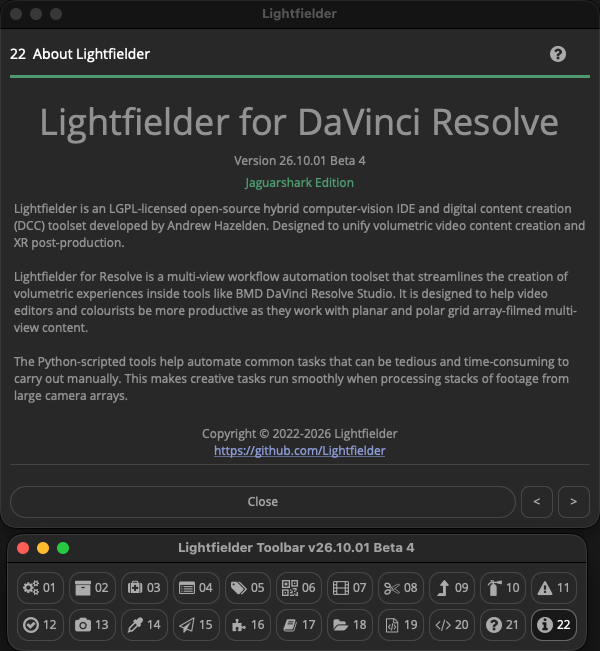

# Lightfielder v26.10.01 B4 for DaVinci Resolve

Created by: [Andrew Hazelden](mailto:andrew@andrewhazelden.com)

## Public Beta 4 Release

This initial documentation is aimed at a professional audience already working in the 3D graphics and immersive media sector.

## Overview

Lightfielder is an LGPL-licensed open-source hybrid computer-vision IDE and digital content creation (DCC) toolset developed by Andrew Hazelden. Designed to unify volumetric video content creation and XR post-production.

Lightfielder for Resolve is a multi-view workflow automation toolset that streamlines the creation of volumetric experiences inside tools like BMD DaVinci Resolve Studio. It is designed to help video editors and colourists be more productive as they work with planar and polar grid array-filmed multi-view content.

The Python-scripted tools help automate common tasks that can be tedious and time-consuming to carry out manually. This makes creative tasks run smoothly when processing stacks of footage from large camera arrays.

Note: Lightfielder is also available as a separate standalone app. This self-hosted version is called [Lightfielder Ops](https://github.com/Lightfielder/LightfielderOperators). The Ops (Operators) software is now entering its initial private beta testing phase.

## Am I Lightfielder?

You might be. Are you a tech artist, photographer, or filmmaker working with multi-view content in the [plenoptic imaging](https://en.wikipedia.org/wiki/Light_field_camera) domain? Do you frequently capture or process lightfield data? If YES, then you can easily use the colloquial term "Lightfielder" to describe your craft.

## What is a Lightfield Capture of a Scene?

Lightfield recordings of a real-world or virtual scene provide a unique experience compared to traditional legacy VR/XR media types (like 360VR, 180VR, Fulldome, 3DTV, or Spatial Media).

When digitized, a lightfield based 3D scene-graph stores the captured content using a data structure that holds the individual samples of light rays. Each ray has a unique light intensity property and a light ray direction property that indicates the angle that the light beam is travelling along. 

This allows the observer of a lightfield scene asset to experience free-view motion (aka 6DoF navigation) when viewing the digital environment. The observer can interactively re-adjust the synthetic camera properties such as aperture, exposure, colour temperature, and shutter angle to sculpt the final cinematic result. A lightfield photography/filmmaking approach can be used to display a still representation of a scene (freezing a single moment in time), or a full motion version of the scene which supports narrative storytelling goals.

## GitHub Downloads

Go to the GitHub [Releases page](https://github.com/Lightfielder/Lightfielder-DaVinci-Resolve/releases) to access the latest build of Lightfielder.

## Free Open-Source License Terms

Lightfielder is cross-platform compatible and works across Linux, macOS, and Windows. The software is released under a permissive free open-source LPGPL/GPL license. Attribution is required and must be maintained on forks of the Lightfielder project's codebase and scripts. 

Note: The bundled sound effects were acquired with a license specifically for the Lightfielder/Kartaverse project so are not open-source/public domain licensed content.

## Software Requirements

- If you are running Lightfielder with Resolve Studio, it is suggested to have either Resolve Studio v20.x or 21.1.x installed.
- If you are running Lightfielder with Resolve (Free), it is suggested to have either Resolve (Free) v18.6.6 or v19.0.3 installed. Using v19.0.3 is the highest version number possible with a free copy of Resolve for the reasons listed below:
	- Note: BMD removed access to the Resolve API's UI Manager (GUI) user interface library at Resolve (Free) v19.1.
	- Note: BMD removed access to the Resolve API's entire Python scripting functionality at Resolve (Free) v21.1.0.

**Resolve (Free) Volumetric Beginner Tip:**

If you are a hobbyist, indie filmmaker, or educator, and your volumetric camera array uses 4K UHD resolution video cameras, you can still use a majority of the Lightfielder features with DaVinci Resolve (Free).

This approach certainly gives an accessible and affordable route to enter volumetric research and learning. If you enjoy the process, you can easily upgrade to Resolve Studio at any time, when you wish to unlock access to higher-resolution editing timelines, or the extra features BMD offers in their paid products.

## Example Projects

Additional learning content and example project files are being prepared for Lightfielder this month.

- [Pikachu Still Frame 50 View (A1-E5) ZIP Archive (300 MB)](https://we.tl/t-STJrEEaqnLC4tVGK)

## Accessing Lightfielder inside Resolve

The Lightfielder workflow automation scripts are accessed using the "Workspace \> Scripts \> Lightfielder \> " menu system, or the Lightfielder toolbar with the (Command + F11) hotkey.

## Table of Contents

- [ReadMe (You are here)](index.md)
- [ChangeLog](project/changelog.md)
- [Known Issues](project/known-issues.md)
- [PunchList](project/punch-list.md)
- Deployment
 	- [Install Python](installation/install-python.md)
	- [Install Lightfielder](installation/install-lightfielder.md)
 	- [Uninstalling Lightfielder](installation/uninstall-lightfielder.md)
- Usage
	- [Toolbar Scripts](usage/toolbar.md)
		- [00 Toolbar](usage/scripts/00-toolbar.md)
		- [01 Preferences](usage/scripts/01-preferences.md)
		- [02 Bin Templates](usage/scripts/02-bin-templates.md)
		- [03 Shotlog Pre-Flight](usage/scripts/03-shotlog-preflight.md)
		- [04 Import Footage](usage/scripts/04-import-footage.md)
		- [05 Metadata Sync](usage/scripts/05-metadata-sync.md)
		- [06 Still Frames Export](usage/scripts/06-still-frames-export.md)
		- [07 Create EDLs](usage/scripts/07-create-edls.md)
		- [08 Batch Trim](usage/scripts/08-batch-trim.md)
		- [09 EDL Stack Swizzle](usage/scripts/09-edl-stack-swizzle.md)
		- [10 EDL Checker](usage/scripts/10-edl-checker.md)
		- [11 Log Viewer](usage/scripts/11-log-viewer.md)
		- [12 Video Track Solo](usage/scripts/12-video-track-solo.md)
		- [13 Camera Contact Sheet](usage/scripts/13-camera-contact-sheet.md)
		- [14 Grade Automation](usage/scripts/14-grade-automation.md)
		- [15 EDL Export](usage/scripts/15-edl-export.md)
		- [16 Extensions](usage/scripts/16-extensions.md)
		- [17 Edit Jupyter Link](usage/scripts/17-jupyter-link.md)
		- [18 Media Command](usage/scripts/18-media-command.md)
		- [19 Edit Python Module](usage/scripts/19-edit-python-module.md)
		- [20 Show Console](usage/scripts/20-show-console.md)
		- [21 Documentation](usage/scripts/21-documentation.md)
		- [22 About Lightfielder](usage/scripts/22-about-lightfielder.md)
	- [Metadata Tags](usage/metadata-tags.md)
	- [Shotlog Format](usage/shotlog.md)
	- [Deliver Page Presets](usage/deliver-page-presets.md)
	- [Unit Tests](usage/unit-tests.md)

## Workflow Guides

- [Lightfielder Live Grade Video Flowchart](workflow-guides/lightfielder-live-grade-flowchart.md)
- [Lightfielder HDR Image Based Rendering](workflow-guides/lightfielder-hdr-image-based-rendering.md)
- [Volumetric Color Decision Lists](workflow-guides/volumetric-color-decision-lists.md)
- [PBR-GS Physically Based Rendering of Gaussian Splats](workflow-guides/physically-based-rendering-of-gaussian-splats.md)
- [The OBJ-GS Guide | Wavefront OBJ Format Extensions for VFX](workflow-guides/obj-gs.md)

## Blog Content

- [Exploring the Puerto Rico Caveverse Project](https://medium.com/@andrewhazelden/kartaverse-journeys-f5a115840fa1)
- [Is this the right time to do Lightfield & 6DoF Virtual Production?](https://medium.com/@andrewhazelden/is-this-the-right-time-to-do-lightfield-6dof-virtual-production-ee0841bb500c)
- [6DoF VP (Virtual Production) Learning Resources for the Rest of Us](https://medium.com/@andrewhazelden/kartaverse-journeys-e482c15756b0)
- [XR & VP Asset Management](https://medium.com/@andrewhazelden/xr-vp-asset-management-c01a6e50fd8b)
- [Raytraced Volumetric Video Stitching](https://medium.com/@andrewhazelden/raytraced-volumetric-video-stitching-d907678d61f4)
- [Applying MAGI High Frame Rate Capture ideas to 4D Volumetric Scanning](https://medium.com/@andrewhazelden/applying-magi-high-frame-rate-capture-ideas-to-4d-volumetric-scanning-48c87e61f7d7)
- [Parametric Genome Driven Digital Human Modeling and Rendering Workflows 🧬](https://medium.com/@andrewhazelden/parametric-genome-driven-digital-human-modeling-and-rendering-workflows-ad71424b7088)

