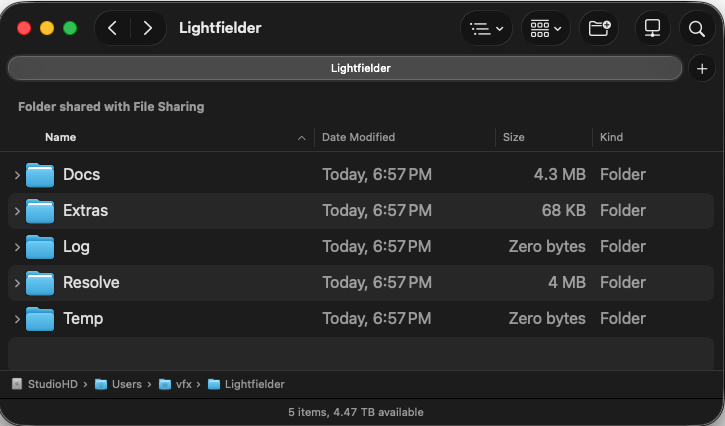

# Lightfielder | Scripts

## Open | Open Lightfielder Folder

This script opens the "`Lightfielder:/`" PathMap, which typically expands to the relative folder UNIX path of:  

> `$HOME/Lightfielder/`

### Script Usage:

1. Open Resolve. Select the menu item: "Workspace > Scripts > Lightfielder > Open > Open Lightfielder Folder"
