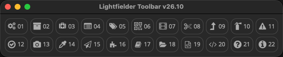
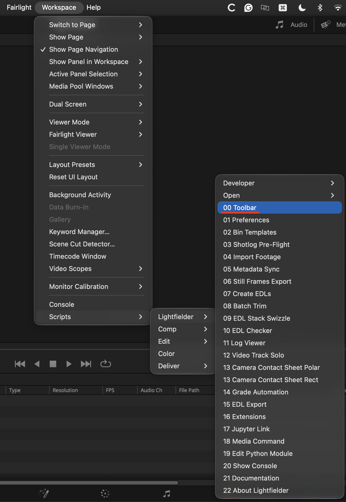
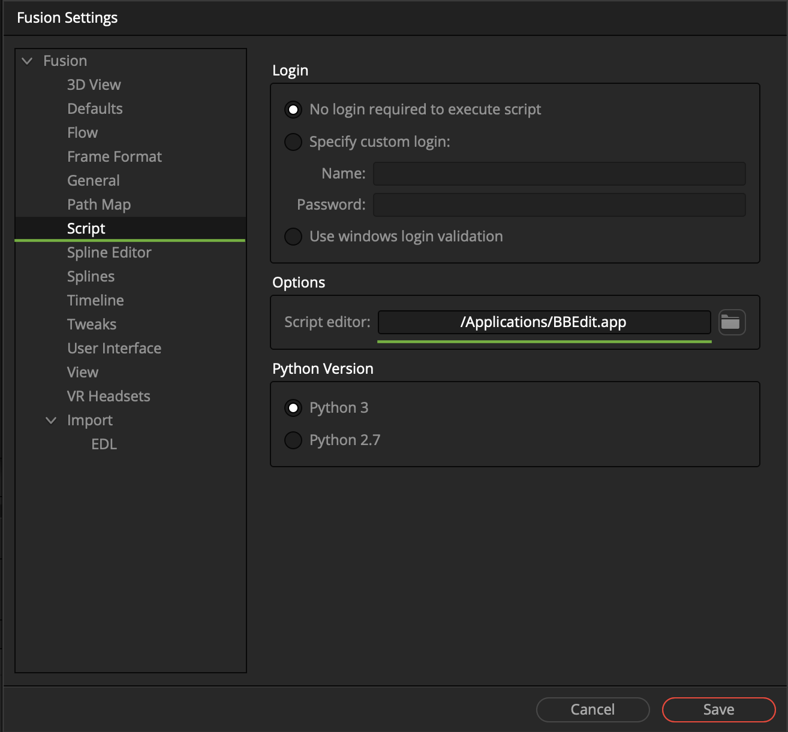

# Lightfielder | Toolbar Scripts

## Overview

Lightfielder ships with a custom toolbar. The scripts are numbered in linear order to help make it quick to access individual tools.

The DaVinci Resolve Studio based Lightfielder workflow automation scripts are accessed using the "Workspace \> Scripts \> Lightfielder \> Toolbar" menu item.

The scripts present in this menu area include:

- [00 Toolbar](scripts/00-toolbar.md)
- [01 Preferences](scripts/01-preferences.md)
- [02 Bin Templates](scripts/02-bin-templates.md)
- [03 Shotlog Pre-Flight](scripts/03-shotlog-preflight.md)
- [04 Import Footage](scripts/04-import-footage.md)
- [05 Metadata Sync](scripts/05-metadata-sync.md)
- [06 Still Frames Export](scripts/06-still-frames-export.md)
- [07 Create EDLs](scripts/07-create-edls.md)
- [08 Batch Trim](scripts/08-batch-trim.md)
- [09 EDL Stack Swizzle](scripts/09-edl-stack-swizzle.md)
- [10 EDL Checker](scripts/10-edl-checker.md)
- [11 Log Viewer](scripts/11-log-viewer.md)
- [12 Video Track Solo](scripts/12-video-track-solo.md)
- [13 Camera Contact Sheet](scripts/13-camera-contact-sheet.md)
- [14 Grade Automation](scripts/14-grade-automation.md)
- [15 EDL Export](scripts/15-edl-export.md)
- [16 Extensions](scripts/16-extensions.md)
- [17 Edit Jupyter Link](scripts/17-jupyter-link.md)
- [18 Media Command](scripts/18-media-command.md)
- [19 Edit Python Module](scripts/19-edit-python-module.md)
- [20 Show Console](scripts/20-show-console.md)
- [21 Documentation](scripts/21-documentation.md)
- [22 About Lightfielder](scripts/22-about-lightfielder.md)

**Tip:** Hold down the Shift key when clicking on a toolbar item to force-reload the script. This is handy if you have edited the script and want to refresh the view to show the changes.

**Tip:** Hold down the Command (macOS) or Control (Win/Linux) key when clicking on a toolbar item to edit that Python script. This works if you have a script editor program defined in the Fusion page settings.

If you do not have a script editor defined, then Resolve will switch to the Fusion page, and display the Fusion settings window to allow you to customize the script editor preference.

A typical value for the Script editor filepath would be something like `/Applications/BBEdit.app` on macOS. On Linux workstations a Script editor filepath might be set to `/usr/bin/xed` or `/usr/bin/gedit`. On Windows you might choose to use a Script editor filepath that points to a copy of VS Code or Notepad++.

This feature requires the "xdg-open" package to be installed on Linux.
